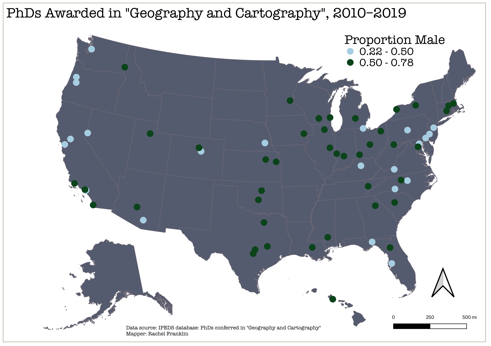
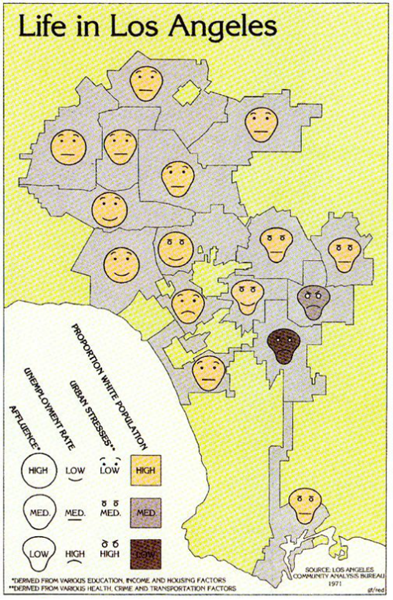
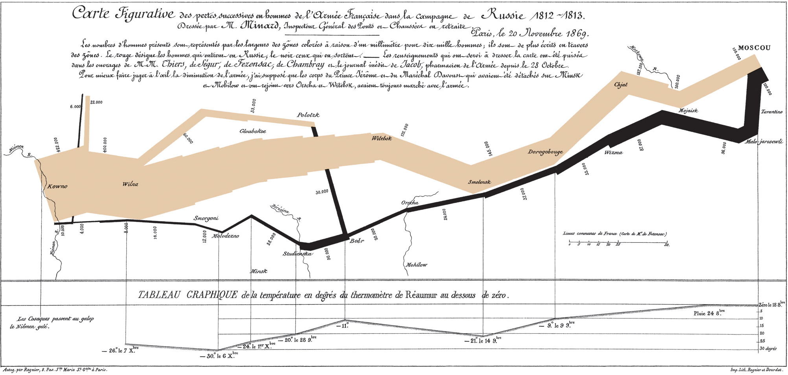
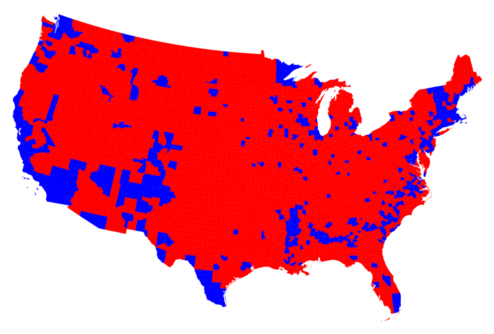
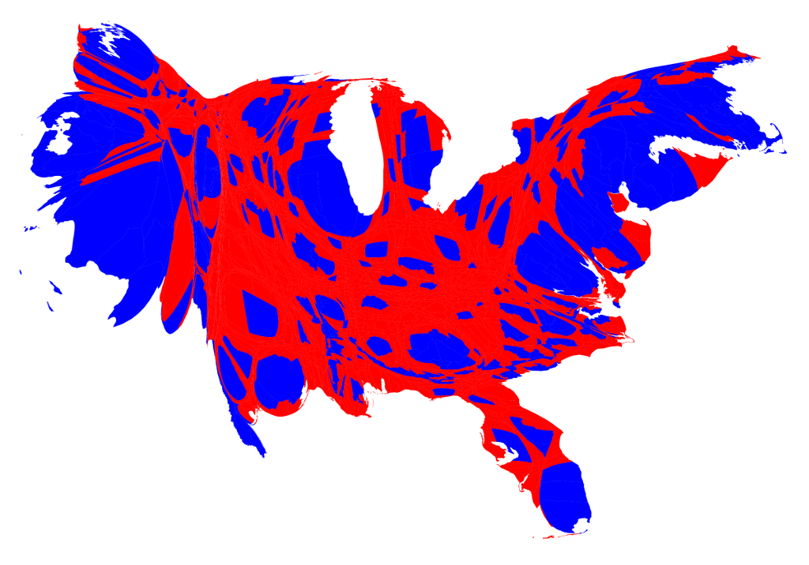

# 

{fig-align="center"}

# Goals for today's session

-   Comfort with basic cartographic principles
-   Ability to match symbology to data type
-   Introduction to map elements

# The power of maps

## Racial segregation in Detroit, Michigan

{fig-align="center"}

# Visualizing spatial data

## Representing different kinds of information

The way in which we display data on the map needs to match not only the type of data but also the type of feature

-   **Nominal** -- labels
-   **Categorical** -- different symbol or color for each category
-   **Ordinal** -- we want to use color or symbol size to convey the increase in value that goes with each category
    -   Graduated or proportional symbol maps.\
-   **Numerical** – for points and lines, we use lines thickness or symbol size to express variations in value
    -   For polygons we use graduated color or choropleth maps
    -   Single color that changes in intensity to convey changes in value
    -   Sometimes two colors are used

## Classification Schemes

Mapping continuous data means we need a meaningful way to create categories -- this is called classification

-   Similar to choices that are made in generating a histogram

-   How we allocate values to categories will affect our final map

    -   This means number of categories
    -   But also the classification scheme itself

-   Ideally you are able to justify your choices (good general advice!)

    -   What is the takeaway message you want to convey?
    -   Who is your audience?

## Types of classification

-   **Natural breaks (Jenks)** -- looks at the distribution of values and sets the break points at “natural breaks” in the data
-   **Equal interval** -- Creates a set number of classes of equal size
-   **Fixed interval** -- Same as equal interval, except you decide the size of the interval and the number of classes depends on that decision (e.g., by 1,000s)
-   **Quantile (equal count)** -- puts the same number of features into each class
-   **Standard deviation** -- creates categories based on the number of standard deviations away from the mean
-   **Pretty breaks** -- Breaks categories at round numbers
-   **Manual** -- you choose the break points yourself

## 

{fig-align="center"}

## 

{fig-align="center"}

## 

{fig-align="center"}

## 

{fig-align="center"}

## 

{fig-align="center"}

## 

{fig-align="center"}

## QGIS symbology interface

{fig-align="center"}

## What if we look at the histogram?

{fig-align="center"}

# Map design

## What do we need to think about?

-   **Map elements** – the pieces of a map that make it a finished (and polished product)
    -   Individual elements should contribute to conveying information, not detract from it
    -   Limit clumping together of elements
    -   Limit use of multiple fonts and colors
-   **Map symbology** – the way in which the information the map conveys is portrayed
    -   Colors – hue, intensity, and saturation
    -   Symbols – size and type
-   By necessity, maps are selective of the information they show and information is generalized

## Choosing symbols and colors

-   Beauty is in the eye of the beholder, but there are some general guidelines!
-   Water and land should not be given unusual colors---e.g., water is blue not red
-   Increased thickness of lines or larger symbols should match increased value
-   Darker or more intense colors usually go with higher values
-   If you use a color ramp with two colors, your data should also reflect two extremes in value---for example, in and out migration or voting patterns
-   Avoid mixing and matching lots of different patterns on the same map---the eye can’t handle it

## For those who like color---[Color Brewer](https://colorbrewer2.org/#type=sequential&scheme=BuGn&n=3)!

{fig-align="center"}

## What makes a map?

::::: columns
::: {.column width="65%"}

:::

::: {.column width="35%"}
Cartographic elements

1.  Map object
2.  Title
3.  Neatline
4.  Scale bar
5.  Legend
6.  North arrow
7.  Inset map
:::
:::::

# Types of maps

## So many ways to visualize information on a map!

-   **Thematic Maps** -- organize and display spatial variation of a single variable
-   **Choropleth maps** -- changes in a variable are classified and mapped by some administrative category (e.g. countries or states)
-   **Dasymetric maps** -- Uses additional information to allocate value within polygons
-   **Isoline** or **contour maps** -- lines delineate areas of similar value. E.g., air pressure or elevation
-   **Reference maps** -- may display lots of different types of information
    -   Topological maps or atlases
-   **Dot** maps, **picture symbol** maps, **graduated symbol** maps
-   **Network** and flow maps -- show direction and magnitude of flows
-   **Cartograms**---a unit’s display area is determined not by its actual area but by an attribute value

# Examples

## Choropleth map

{fig-align="center"}

## Dasymetric map

{fig-align="center"}

## Reference map

{fig-align="center"}

## Topological map

{fig-align="center"}

## Dot density map

{fig-align="center"}

## A fun one: Chernoff faces

For more information, check out this [post](https://mapdesign.icaci.org/2014/12/mapcarte-353365-life-in-los-angeles-by-eugene-turner-1977/).

{fig-align="center"}

## Flow map (a famous one!)

{fig-align="center"}

## Cartograms

{fig-align="center"}

## Cartograms

{fig-align="center"}

## Cartograms: 2020 presidential election comparison

{fig-align="center"}

# Maps are more than pretty objects!

## Questions we can ask about maps and spatial data

-   What are the high and low values and where are they?
-   Does there appear to be a relationship between location and value?
-   Do similar values appear to be located close together, or clustered? Is another spatial pattern discernible?
-   Are there characteristics of areas that appear to correspond with particular sets of values? e.g., coastal or inner city.
-   Would the pattern change if we change the scale of analysis? For example, what happens to the spatial pattern if we go from counties to states?

# Next up: Tutorial 2
