# Goals for this session

- Spatial analysis overview
- Common tools/methods in a GIS environment

# What is "spatial analysis"?

## Spatial analysis for urban and regional analysis

Often we use spatial analysis tools to *extract* information

- Length of paved road in a region
- Number of universities in a place
- Number of inhabitants within a distance of a service
- Area within a distance of a road or feature (like a bus stop or metro station)

## A variety of types of spatial analysis

### According to Longley

- **Queries and reasoning** -- no changes are made to the database and no new information is produced
  - e.g., how many cities within 300km of L'Aquila?
- **Measurements** -- Describing aspects of geographic data, like length, area, or shape
  - For example, calculating the size (or area) of a parcel
- **Transformations** -- Changing or combining data to create new data, using logical, mathematical, or geometrical rules
- **Descriptive summaries** -- summary statistics for spatial data
- **Optimization** -- Finding the best locations for a set of objects
  - For example, best locations for public services
- **Hypothesis testing** -- Making generalizations about a population from a sample
  - Could this spatial pattern have occurred by chance?

## Types of spatial analysis

### continued

- We've covered *queries and reasoning*
- Measurement is either embedded in feature class information (e.g., length of a line segment) or is straightforwardly calculated in a GIS---this is GIS bread and butter functionality!
- This lecture focuses on **transformations**

## Transformations

- **Buffers** -- Create an area of a specific and constant width around a point, line, or polygon This can be used to identify all objects falling within a certain distance of the original feature
- **Point in polygon** -- Associates points with polygons
  - Counts the number of points within a polygon or...Attaches polygon characteristics to points
  - This is usually what people mean when they refer to a *spatial join*
- **Polygon overlay** -- Determining whether two polygons overlap, the extent of their overlap, and what new polygons are created by the overlap
  - Can be thought of as an intersection or a union of units and information
- **Spatial interpolation** -- Estimating the value of a variable for locations where no measurement has occurred. For example, rainfall, temperature, or elevation
  - e.g., Inverse distance weighting or Kriging
- **Density estimation and potential** -- generates a surface from a set of discrete points

# Where to find QGIS spatial analysis tools

## QGIS pulldown menus

\

Check out all the options!

\

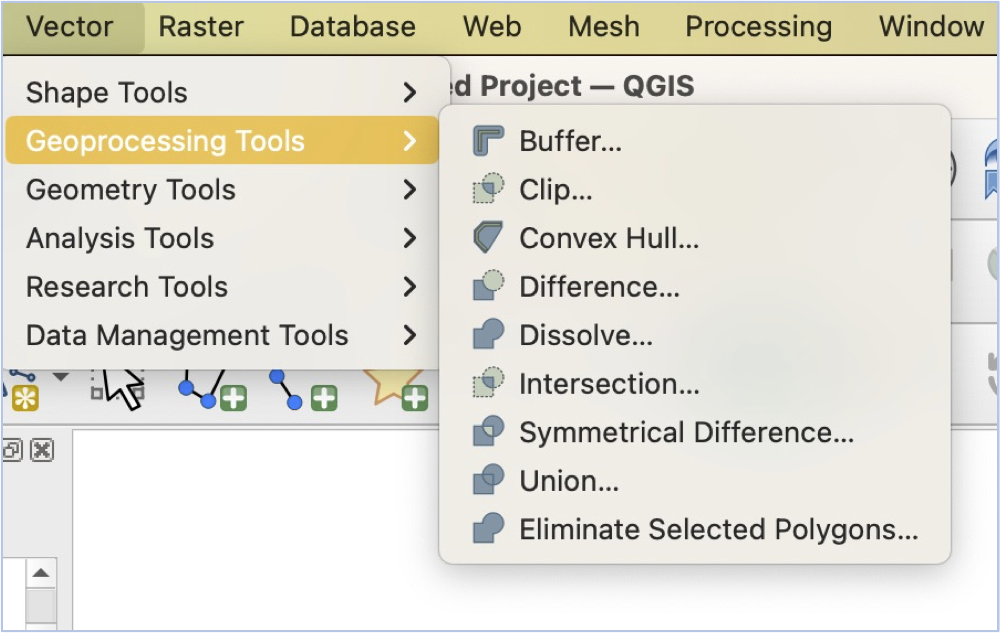{width="80%" fig-align="center"}

## QGIS toolbox

::::: columns
::: {.column width="60%"}
- Located on the main QGIS toolbar
- Can be overwhelming---take the time to poke around
- Most tools work with a common interface/intuition
  - Practice makes...comfortable (if not perfect)
- Search is your friend
  - The key is to know what tools you are searching for!
:::

::: {.column width="40%"}
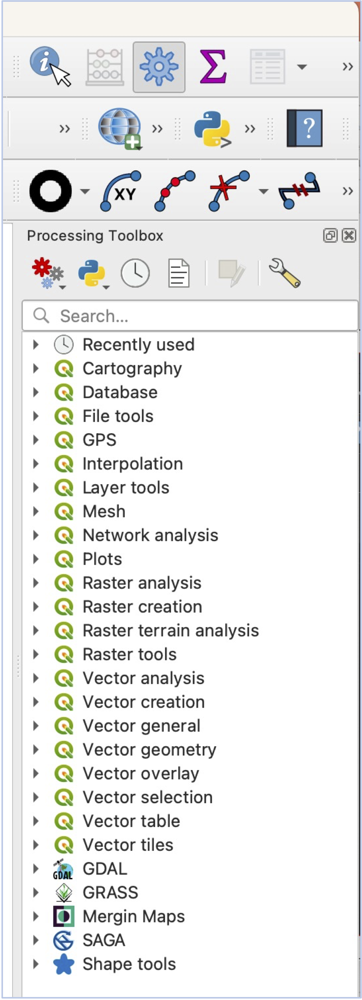{width="55%" fig-align="center"}
:::
:::::

# The most common tools

## Buffers

### Creates a new layer of polygons around a set of input features

\

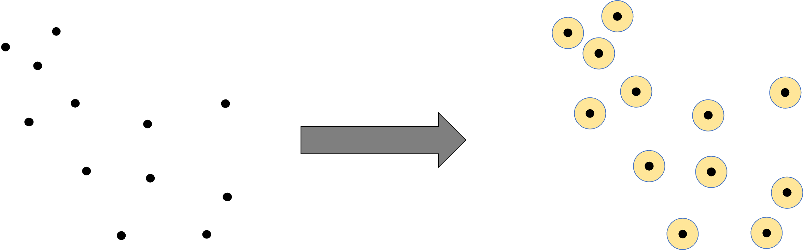{width="70%" fig-align="center"}

## Appealing way to visualise and calculate areas surrounding features

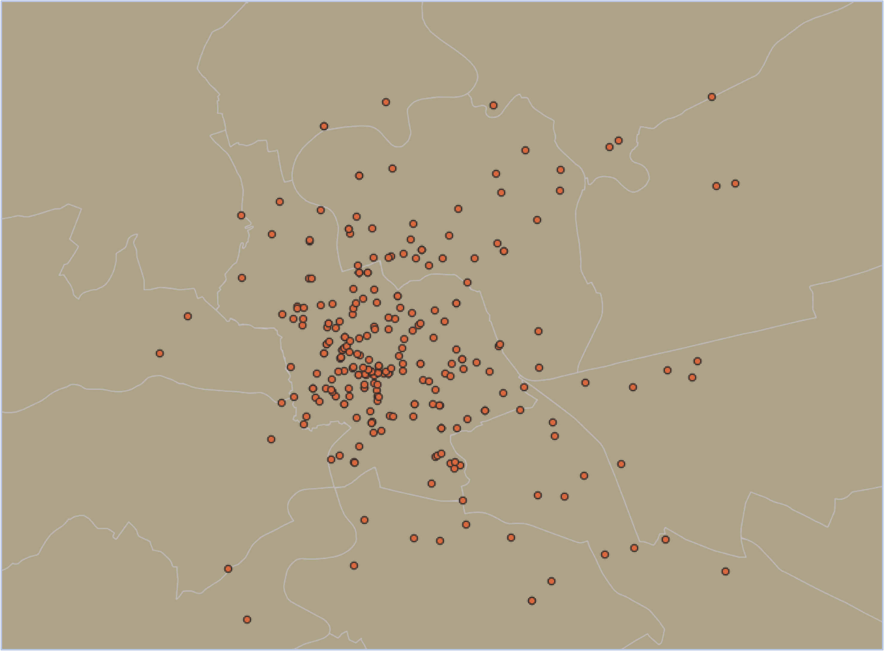{width="70%" fig-align="center"}

## Appealing way to visualise and calculate areas surrounding features

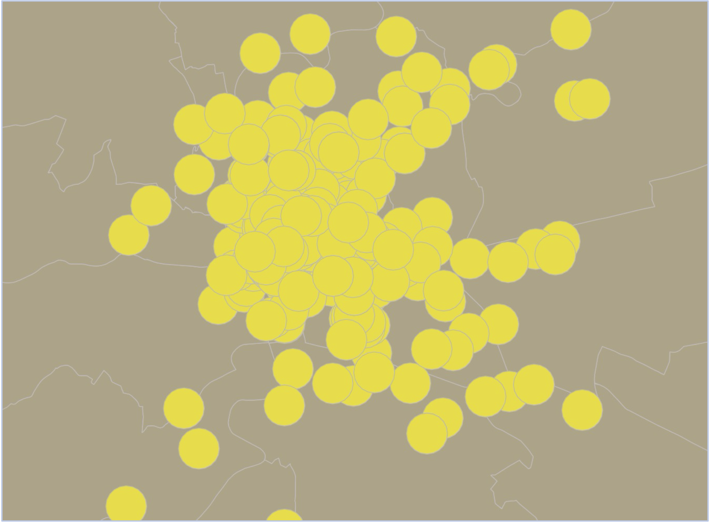{width="70%" fig-align="center"}

## Why would we want buffers? What purpose do they serve?

## Calculating how many features fall into an area

### Point in polygon (aka spatial join)

{width="70%" fig-align="center"}

## Calculating how many features fall into an area

### Point in polygon (aka spatial join)

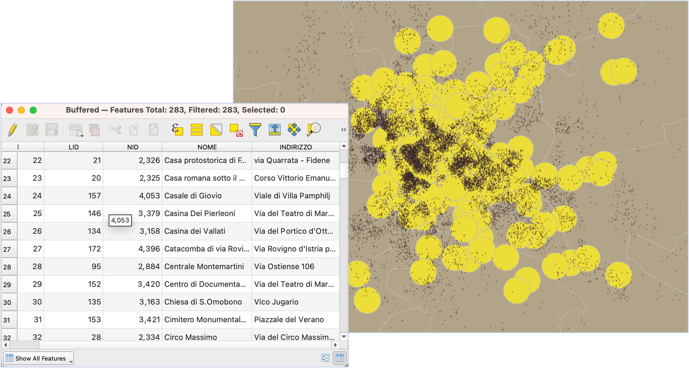{width="80%" fig-align="center"}

## What if we want to know areas where two (or more) layers overlap?

### Intersect

{width="70%" fig-align="center"}

## What if we want to know areas where two (or more) layers overlap?

### Intersect

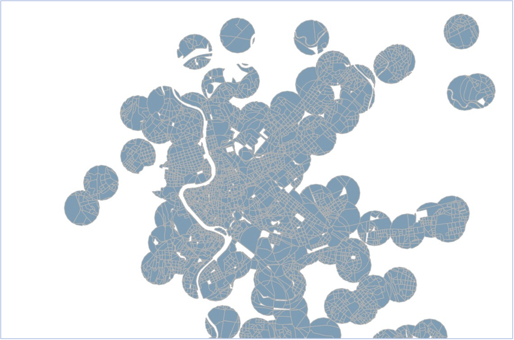{width="70%" fig-align="center"}

## What if we want to know how many people fall into an area?

### Buffers + Intersect (with census area data) for an approximation

{width="70%" fig-align="center"}

## How is this useful?

### What if you only want to rent an AirBnb that’s close to water and cultural locations? 

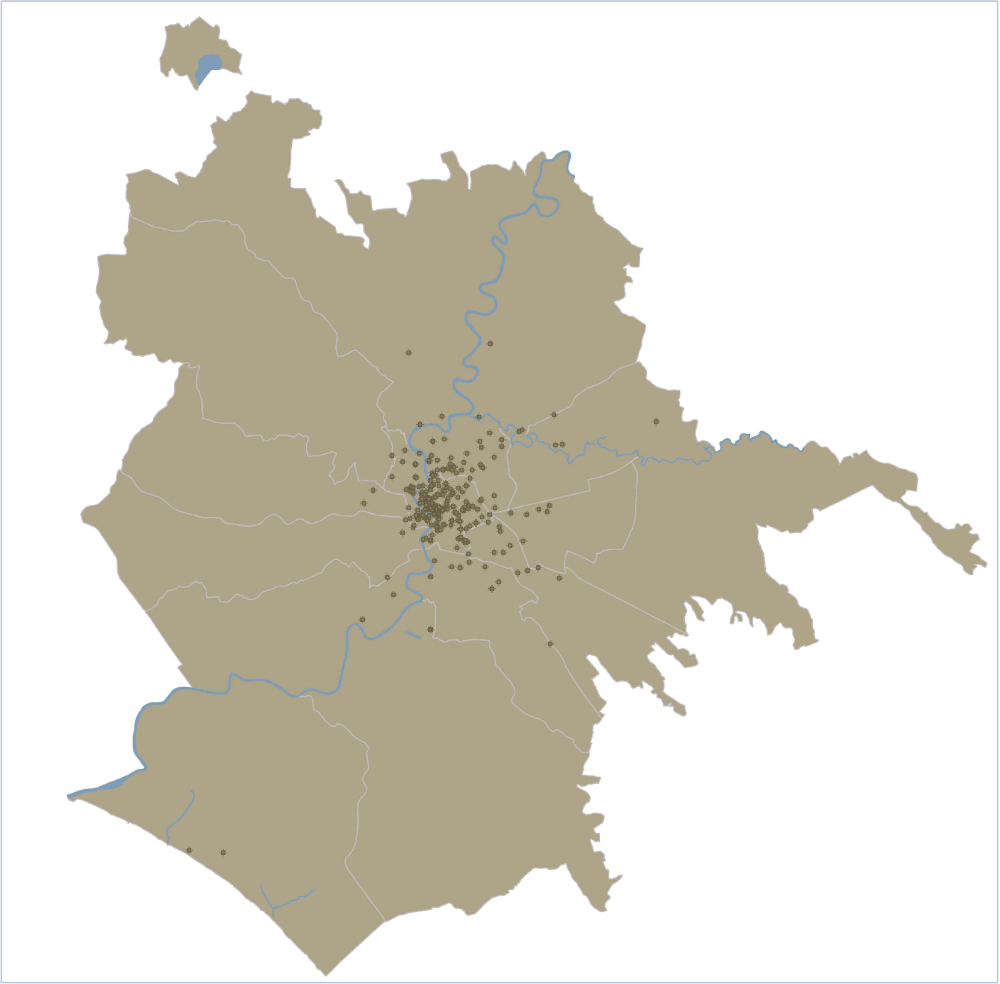{width="70%" fig-align="center"}

## How is this useful?

### What if you only want to rent an AirBnb that’s close to water and cultural locations? 

::: {layout-ncol="2"}
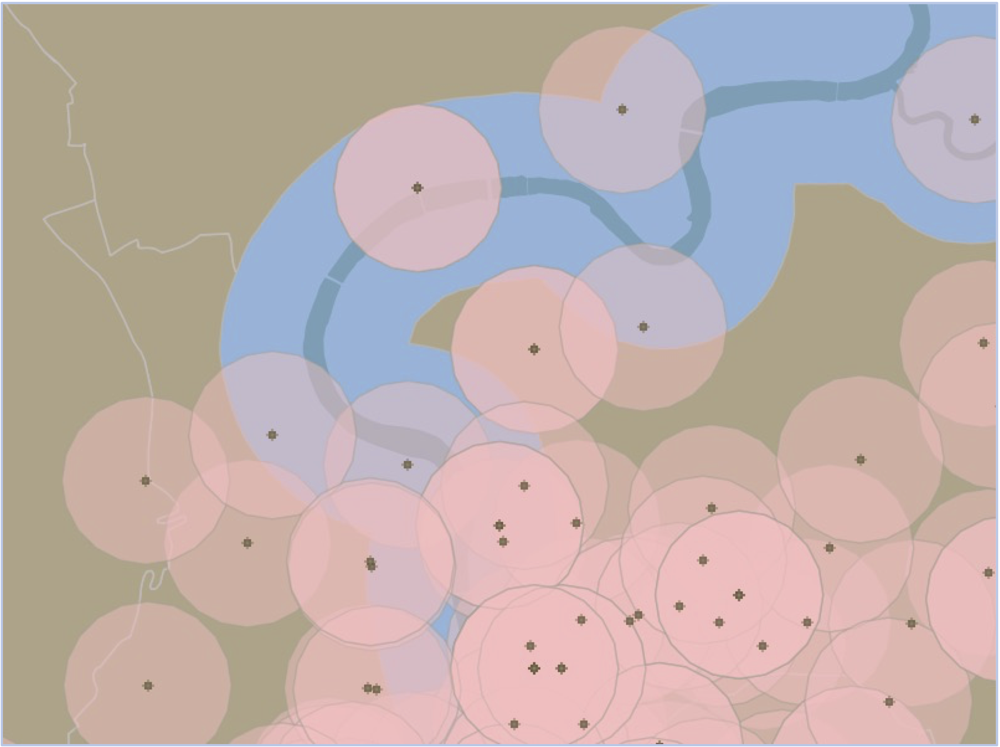

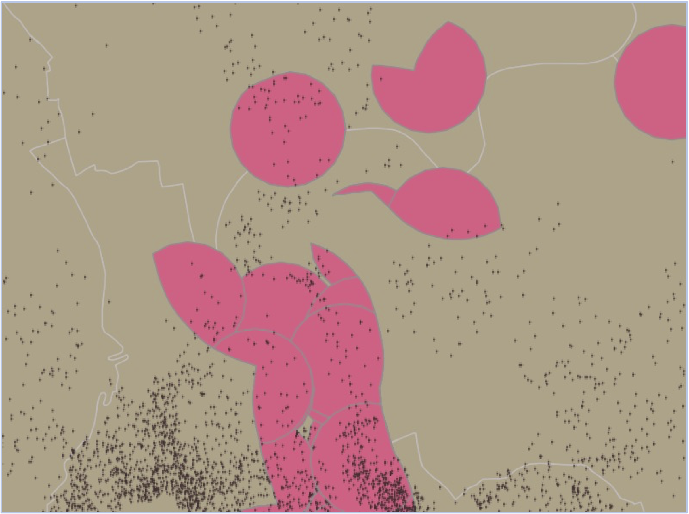
:::

## Grouping features together, based on a common attribute

### Dissolve

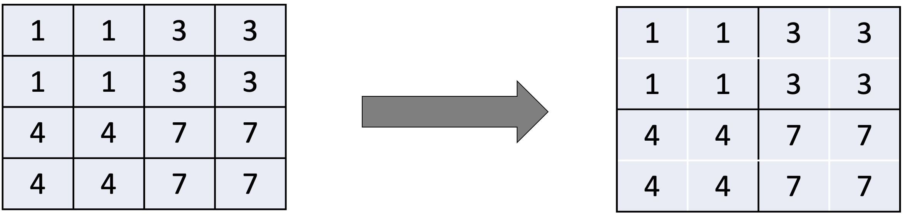{width="70%" fig-align="center"}

## Combining polygons

### Dissolve example

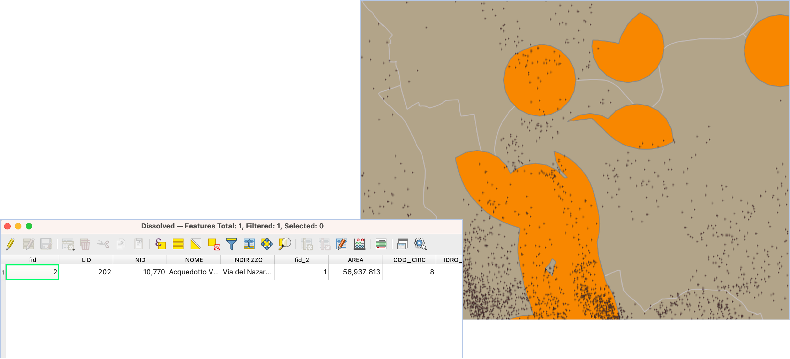{width="70%" fig-align="center"}

## Combining polygons

### Dissolve example 2

{width="70%" fig-align="center"}

## Summary

- So many more tools—this is just scratching the surface
- Most of these tools generate a new layer
  - Pay attention to **naming** AND to **where you’re saving**!
- If you mess up, you can simply run the tool again
- Using Help and the internet is key
- It’s common to need to string together tools to get to a final answer
- Layer names can matter:
  - No spaces or strange symbols.
  - Use \_
  - No starting a layer name with a number (e.g., Pop_2011, not 2011_pop)

# Next up: Tutorial 3!
