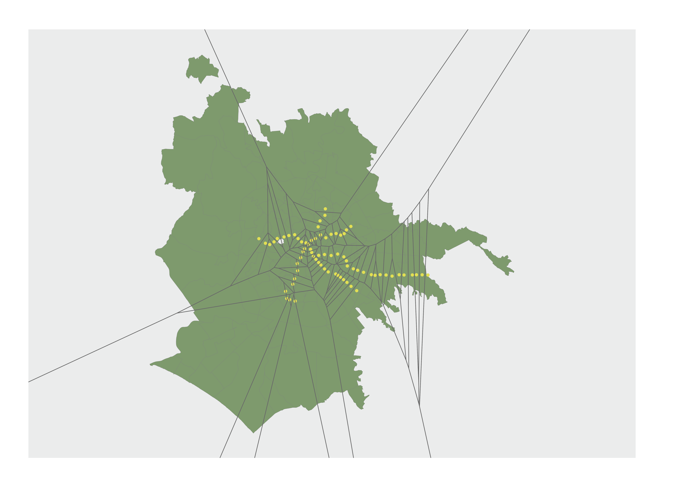
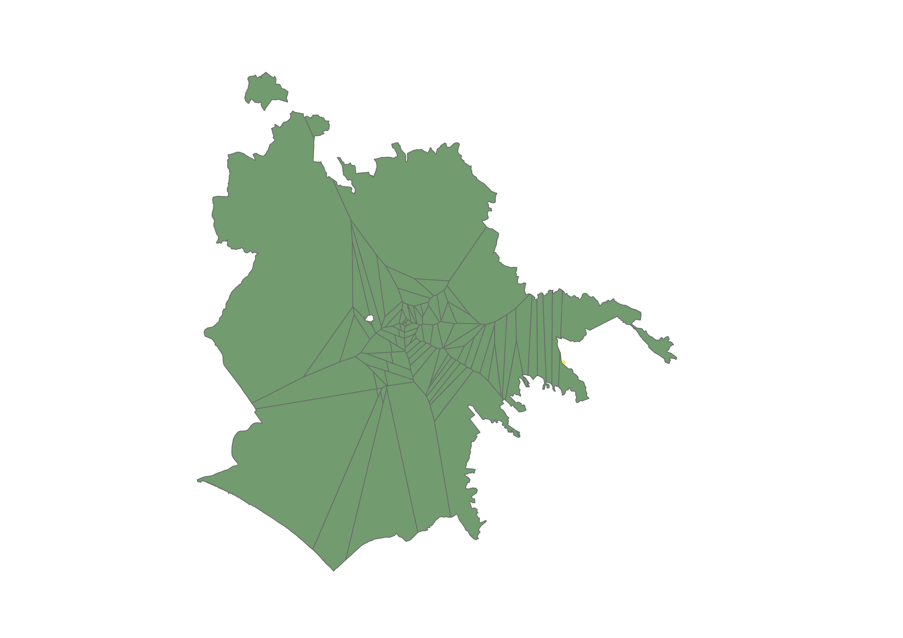
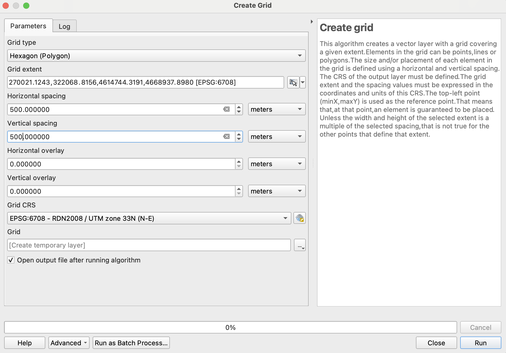
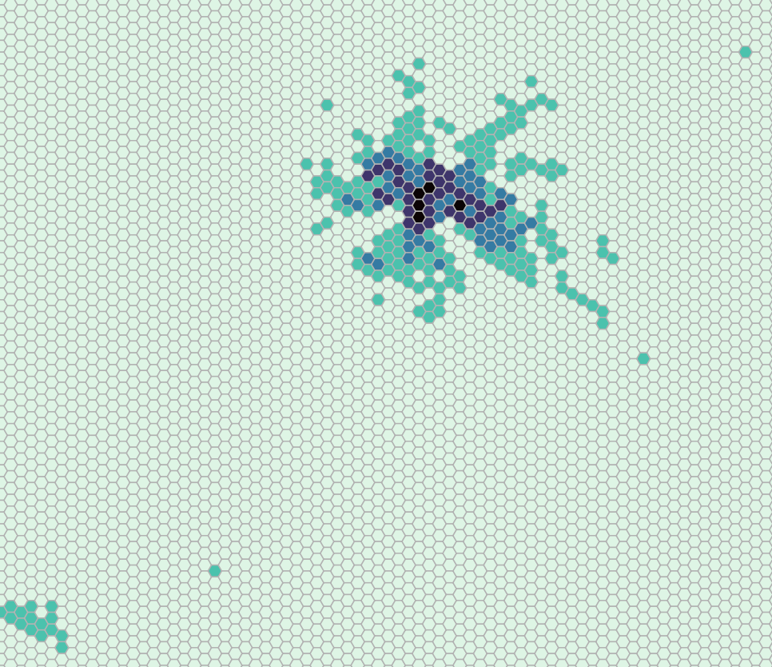
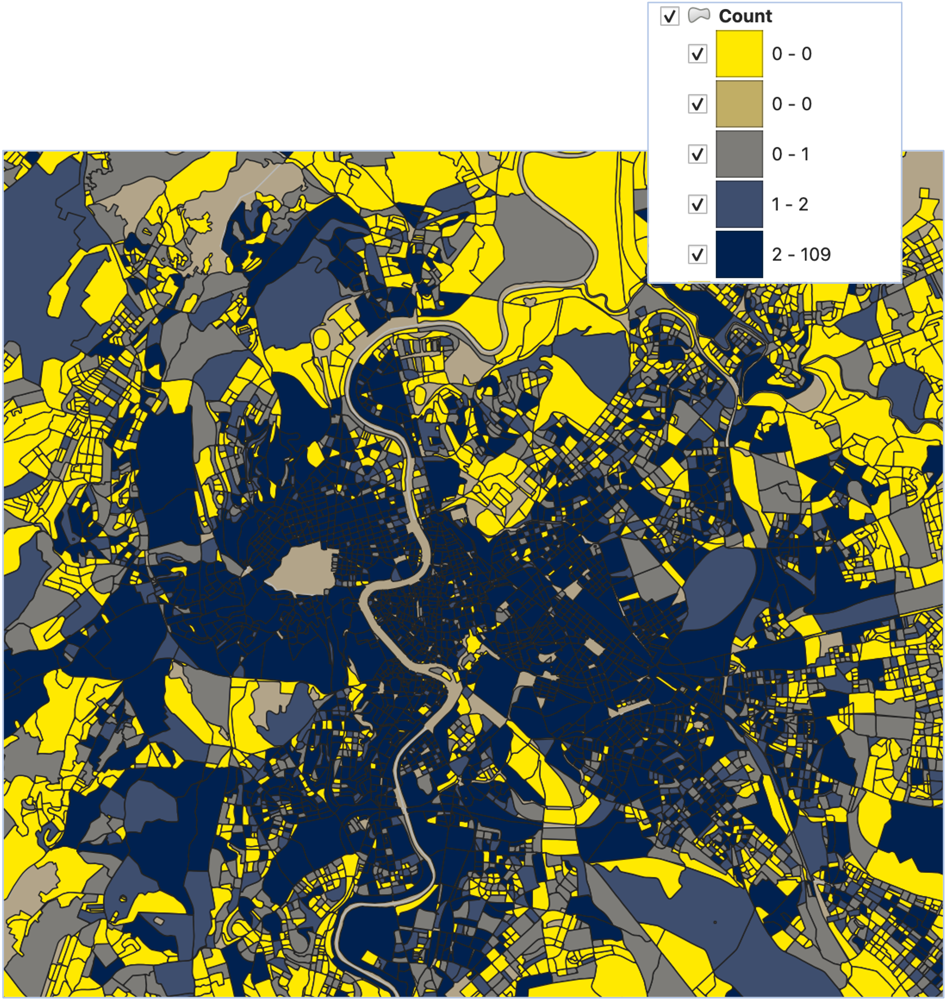
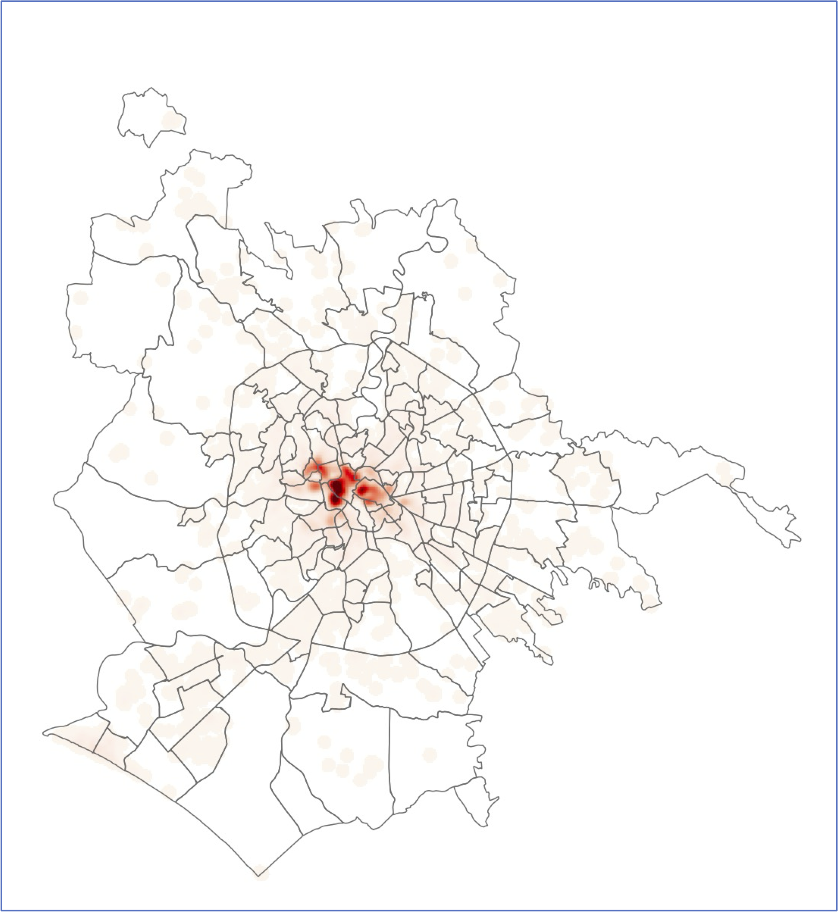
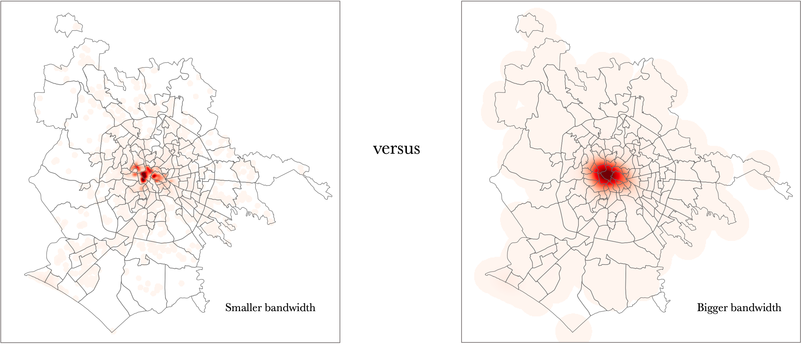
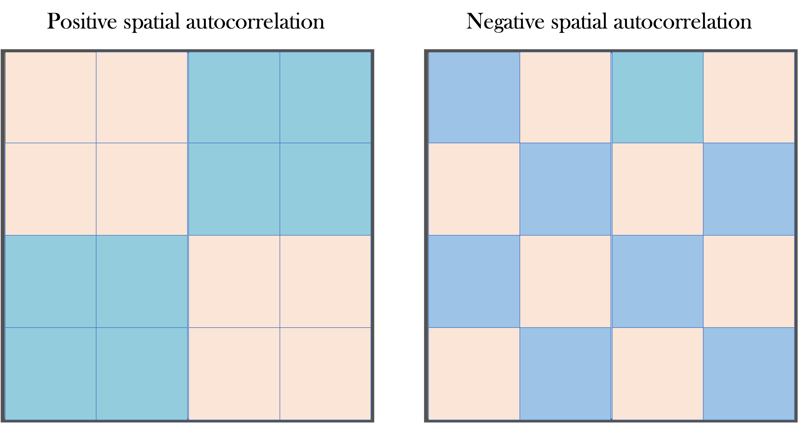
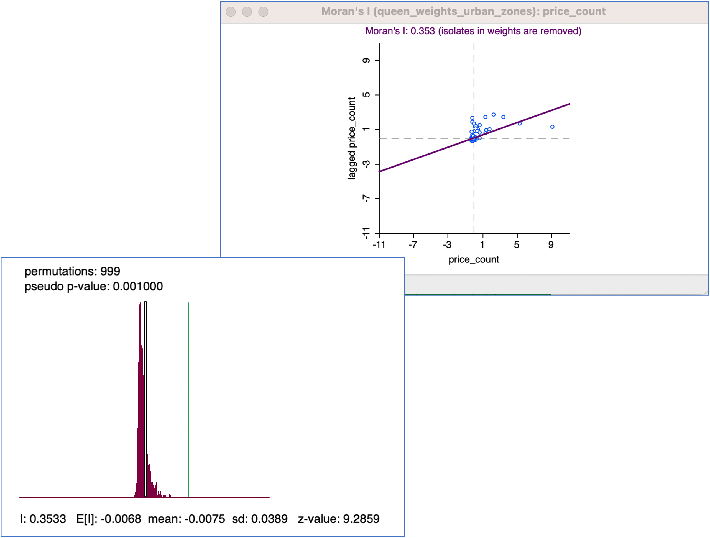
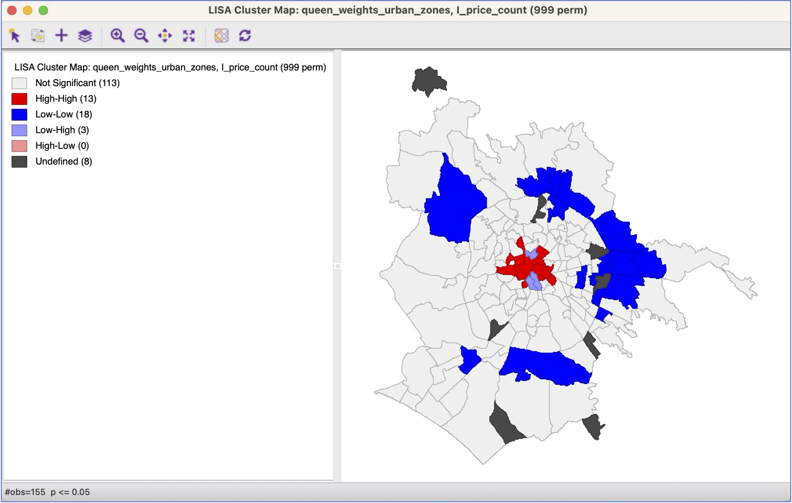

# Goals for this session

- Get comfortable with a few more foundational GIS spatial analysis tools
- Start to see how concepts and tools map onto research questions
- Building understanding of spatial analysis workflows

# Without further ado, let's dive in

## Thiessen (or Voronoi) polygons

### Deriving polygons from points

- What about the case where we might want to go from point features to polygons?
- For example, suppose we want to define “catchment areas” for each metro station in Rome.
  - The assumption being that each person will use the station closest to them

## Thiessen (or Voronoi) polygons

### Deriving polygons from points

{fig-align="center"}

## Thiessen (or Voronoi) polygons

### Allocating areas to their closest points

- In QGIS: `Voronoi Polygons` tool
  - Creates new polygon layer as output
  - Default extent of polygons is the bounded rectangle containing the points
    - Use `buffer region` option to expand boundaries of new polygon layer

## Thiessen (or Voronoi) polygons

### Allocating areas to their closest points

{fig-align="center"}

## How to change boundaries of a layer to match another

### `Clip`

- In QGIS located under Vector \> Geoprocessing
  - Clips---or cuts---one layer, using boundaries of a second layer
  - So here, we can clip Voronoi polygons using the urban area polygon layer

## How to change boundaries of a layer to match another

### Clip

{fig-align="center"}

# Other common tools

## Near (`distance to nearest hub` in QGIS)

### Calculates the straight line distance from the input feature to the nearest feature in a specified feature set

{fig-align="center"}

## Grids

### Creating our own polygons

- Useful for generating uniform polygons as inputs for spatial joins
  - Overcomes shortcomings of administrative geographies which can vary considerably in size
- Also useful for visualizing data in an appealing way
- In QGIS, under `Research Tools` \> `Create Grid`
  - Choice of size and shape of output polygons (e.g., hexagons, squares, diamonds)

## Grids

### Creating our own polygons

{fig-align="center"}

## Grids

### Spatial join with grids: AirBnb

{width="80%" fig-align="center"}

What other tools could we use to improve this visualization?

## Density estimation

## Take our standard approach so far

### Visualising points

{fig-align="center"}

## Take our standard approach so far

### Point in polygon

The usual approach, where we reference counts of occurrences by some spatial unit and/or by area

{fig-align="center"}

## Density estimation

### Here, the darker the polygon, the higher the point count, which can be problematic

::::: columns
::: {.column width="60%"}
{width="55%" fig-align="center"}
:::

::: {.column width="40%"}
- Dependent on choice of spatial unit
- Assumes that points immediately outside the unit have no impact
- An alternative is to generate a surface that estimates the density of points across the study area
- We’ll talk about the most common method:
  - Kernel Density Estimation
:::
:::::

## Density estimation

- With density estimation, we start with a set of points
- These may be simple points (e.g., crime occurrences) or points with data associated with them (e.g., cities with a population attribute)
- In this case, we are looking for alternative ways to visualize and measure the density of points
- This can be useful for:
  - Hot spot identification
  - Alternatives to choropleth mapping

## Kernel density

- Outputs a raster, where we decide the cell size
- Cell contents are the estimated density of points for that area
- Kernel density methods place a kernel of a particular shape and of a particular bandwidth over each point and distributes its value across the kernel
- This kernel is like the neighborhood, except that it surrounds the points and distributes their value underneath the curve
  - Cell densities are then the sum of the kernel intersections that occur

## Kernel density

### Airbnb density in Rome, March 2023

{width="55%" fig-align="center"}

## Kernel density

- Results will depend on cell size and bandwidth (or radius)
  - Larger cell sizes will be grainier
  - Larger radii will result in a smoother surface

{width="55%" fig-align="center"}

# Spatial statistics, a short overview

## Spatial statistics

- Spatial statistics are like regular statistics
- We have numbers we calculate to describe spatial patterns or how values are distributed across space
- Common applications for spatial statistics:
  - to help us understand when a pattern really is unusual or where outliers really are
  - to estimate models that either measure the impact “space” has on our dependent variable or filter that effect out so we can focus on the variables we’re truly interested in

## Spatial statistics

### A big umbrella term

- Point pattern analysis
  - Is the distribution of points random? Uniform? Can we identify clusters?
- **Measures of spatial autocorrelation or dependence**
  - Global – Do we observe positive or negative autocorrelation across our study area
  - Local – Are values correlated with local neighbors?
    - House values
    - Crime
- Capturing spatial heterogenity in relationships and processes
  - e.g., Geographically Weighted Regression

## Spatial autocorrelation

- **Tobler’s First Law of Geography**: “Everything is related to everything else, but near things are more related than distant things.”
- A variable’s values are related to each other in space – they’re correlated
- This means that observations are often not independent of each other
  - For example, house values: If I tell you how much a particular house is worth, does it affect your prediction of the neighboring house’s value?
- We distinguish between two types of autocorrelation: positive and negative

## Spatial autocorrelation

{width="55%" fig-align="center"}

## GeoDa

- [GeoDa]((https://geodacenter.github.io) -- An exploratory spatial data analysis package.
- It’s free and in some ways much more powerful than QGIS or ArcMap
- To use, open GeoDa
  - And then, under File, open geopackage or shapefile
- Native facility with spatial statistics
  - Good first choice for visualization, exploration, and model estimation
  - Plus cartograms, variable smoothing tools, and lots of other exploratory tools

## Spatial autocorrelation

### What is neighborhood?

- All measures of spatial association depend on scale
  - And how we define neighbors
- Neighborhoods can be defined based on distance, contiguity, or nearest neighbors
  - Distance: My neighbors are those who live within a mile of me, for example
  - Contiguity: Refers to polygons. My neighbors are those I share a border with:
    - Queen’s case: Shared borders and corners count for contiguity
    - Rook’s case: Only shared borders count for contiguity
  - k Nearest Neighbors: The k nearest units to mine are considered my neighbors
- 1st order versus 2nd order, etc: We could choose our immediate neighbors, or those that are neighbors of our neighbors.

## Spatial autocorrelation

### Quantifying neighborhood

- When we define our neighborhood, this is implemented using a “weights matrix”
  - Usually 1 and 0’s that indicate yes or no for whether a spatial unit is my neighbor
  - Units are not considered neighbors of themselves
  - These matrices are generally symmetric – If I’m your neighbor, then you’re my neighbor (but this isn’t always the case – e.g., k nearest neighbors)
- How you define your neighborhood can influence results
  - So, best to check how sensitive your results are to your choice of weights
- Ideally choice of weights is informed by data, theory, and previous research

## Spatial autocorrelation

### Global -- Moran’s I

- The most commonly used measure of global spatial autocorrelation
- This is how we estimate the extent of spatial dependence across a set of units for a particular variable
- This is also how we might typically assess whether model residuals are spatially auto-correlated

## Spatial autocorrelation

### Moran’s I -- Airbnb counts across Rome urban zones

::::: columns
::: {.column width="35%"}
- Urban Zones with counts of AirBnb listings
- Weights file
- Significance is generated through randomization
- Interpretation: The line indicates the correlation between numbers of AirBnbs and spatially lagged values
- Positive spatial autocorrelation in the distribution of AirBnbs across Urban Zones in Rome
:::

::: {.column width="65%"}
{width="70%" fig-align="center"}
:::
:::::

## Spatial autocorrelation

### Local Indicators of Spatial Association (LISA)

Local Moran’s I

- Identifies the presence or absence of significant spatial clusters or outliers for each location. A randomization approach is used to generate a spatially random reference distribution to assess statistical significance
- Rather than looking at the entire spatial configuration of units and values at one time---like the global Moran’s I---local indicators of spatial autocorrelation look at each observation at a time, along with values of neighbors

## Spatial autocorrelation

### Getis-Ord Gi\* Statistic

- The resulting Z score tells you where features with either high or low values cluster spatially. This tool works by looking at each feature within the context of neighboring features.
- A feature with a high value is interesting, but may not be a statistically significant hot spot. To be a statistically significant hot spot, a feature will have a high value and be surrounded by other features with high values as well.

## Spatial autocorrelation

### Counts of AirBnb Listings in Rome (GeoDa)

{width="70%" fig-align="center"}

# Next up: Tutorial 4!
