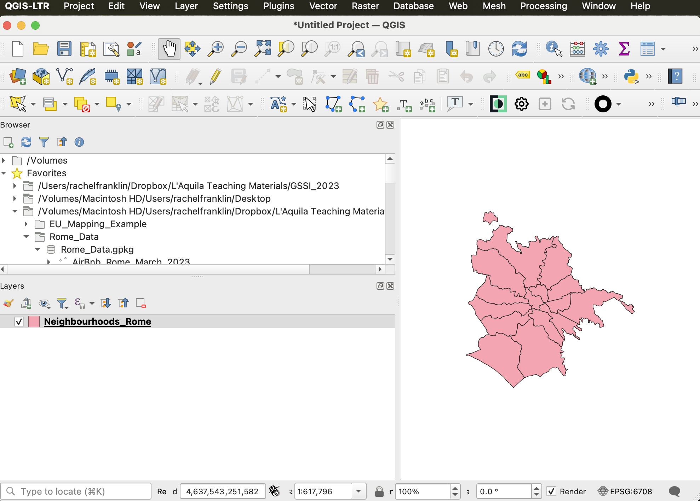
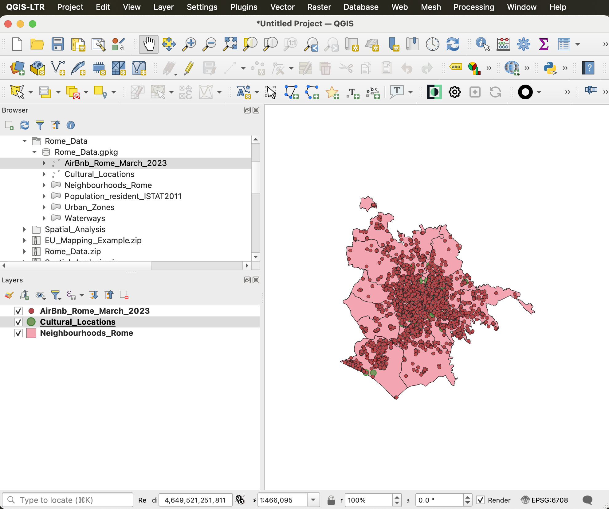
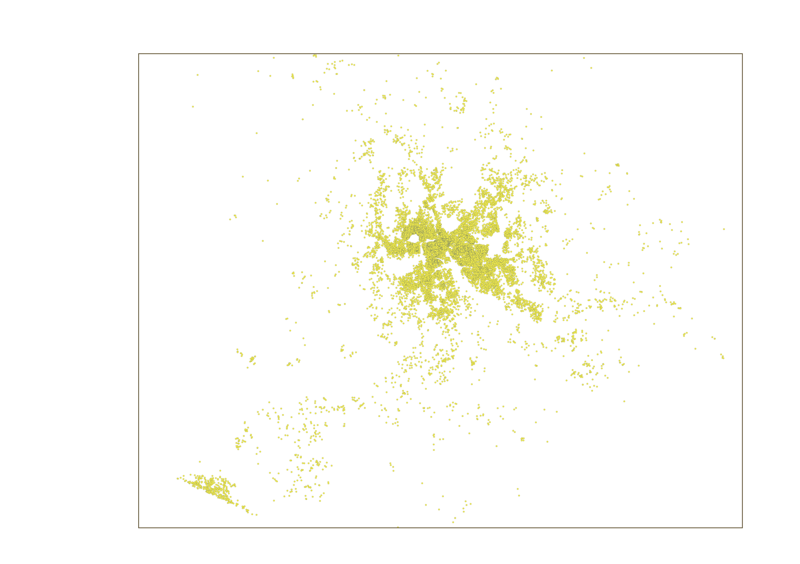

## First things first: Why an old-school GIS application?

It's the 21st century---why are we using a desktop GUI-based software program? A few reasons:

-   A GIS like [QGIS](https://www.qgis.org/en/site/) or ESRI's [ArcGIS Pro](https://www.esri.com/en-us/arcgis/products/arcgis-pro/overview) provides a soft introduction to spatial thinking, managing spatial data files, and visualizing/analyzing information. It's a lot to take in in just a few days.
-   The GUI (graphical user interface) component of a traditional GIS allows you to explore the wide range of cartographic and analytical options available.
-   A GIS is great for visualizing multiple layers of information at once...and catching potential problems early...
-   Once you are comfortable with one GIS package, those skills will translate easily to other environments. You're not just learning a software; you're learning a way of thinking.
-   GIS has amazing functionality, all in one place.

## Downloading QGIS

This week, all of our hands-on practicals will use QGIS. I prefer QGIS because it's *free* and runs locally on both Windows and Macs.

-   From the [QGIS site](https://www.qgis.org/en/site/), choose your operating system and download the **LTR version** of QGIS---3.40.7 Bratislava as of June 2025. **Note** that this is *not* the most recent version of QGIS; we want the more stable LTR.

    -   For Mac users, you may need to right click on the app from your Applications folder to force QGIS to open the first time. For newer Mac OS, you may also need to navigate to System Settings \> Privacy & Security and allow QGIS under "Security." You'll only need to do this once.

## Locating tutorial data

All tutorial data for this week are available [here](Data.qmd).

### What about other data?

For your progettino or other research, you'll locate data online and then download. Be sure to keep organized!

That means:

-   Move data from your Download folder and store somewhere obvious.

-   Keep track of where you found data (e.g., webpage links) and any relevant metadata.

-   When cleaning data and getting ready to work with it, keep a master copy!

     This holds for tutorial data too, although you can always download a new copy if something goes wrong!

## Data hygiene

My recommendations for good data hygiene this week:

-   Create a folder in either Desktop or Documents called GIS_course (or similar). This is where you will save EVERYTHING to do with this week's work.
-   Download the tutorial data files. These are zipped. Expand them and save to your new GIS_Course folder.
-   Keep data and QGIS projects together in the same folder.

## Opening QGIS and getting started

When you open QGIS, you'll notice that there's nothing there to work with! You'll need to add data in order to visualize information, make maps, or perform analysis.

### Adding data

1.  Open QGIS.
2.  The upper left panel provides a browser directory window. Navigate to your GIS_course folder (see image below).
3.   Right click on the directory link and add to Favorites. This will make it easier to find your data and projects this week!
4.  Expand the Rome_Data folder. You should see a cylinder icon and Rome_Data.gpkg. The "gpkg" file suffix indicates a geopackage, a collection of data readable to the GIS. The Rome_Data geopackage contains six layers.
5.  Let's see what these data look like! The easiest way to add data in QGIS is to drag and drop---pull the layer down to the Layers panel and watch it appear.

### Layer visibility

1.  Add the Airbnb and Cultural Locations layers from the Rome_Data geopackage and note how layers stack up in the Layers window.
2.  Note how QGIS draws from the bottom layer up (see below). To re-order layers, drag and drop them above and below each other---see how visibility changes?
3.  Layers can be turned off by unchecking the box next to the layer name. The layer will remain in the project but won't be visible.

### Layer symbology

1.  Layer appearances can be changed. This includes fill colors, line thicknesses, and symbol choices, depending on feature type.
2.  To change feature symbology, double click on a layer\>Symbology *or* right click\>Properties\>Symbology.
3.  Clicking on <Simple Fill> (for polygons) will open a range of options for color and outline ("stroke") width and color.

 **Your turn**: Adjust the symbology and ordering of the three layers.

## Basemaps

Basemaps provide a background for our layers in QGIS and are useful for providing spatial context and, when used sparingly, improving map compositions.

{width="90%" fig-align="center"}

For example, the above image shows the distribution of Airbnb rentals in Rome for March 2023. However, without any additional spatial context, it's hard to say much about the distribution of points.

### Adding a QGIS basemap plug-in

QGIS offers a variety of plug-ins that expand core QGIS capacity. The QuickMapServices plug-in offers connection to a range of basemaps.

-   To install QuickMapService, use the Plugins pulldown menu on the main QGIS window and search plug-ins for "QuickMapSerices".
-   Install. Basemaps are then accessed via the Web pulldown menu and QuickMapServices
    -    There are additional basemaps available: click on QuickMapServices Settings\>More services\>Get contributed pack.
-   To add a basemap, simply choose one from the list. OSM, CartoDB, and Google are good choices.

{width="90%" fig-align="center"}

## QGIS: projects versus data

Like other analytical software applications, QGIS does *not* store data in the project. What does this mean? When you save your project, you save a set of instructions for which data to include and how to display them (e.g., selections and symbolization). You **don't** save the layers themselves. They remain in their original location.

 In short: you want to move data and project together.

This also means that you can work with the same layers in multiple projects and also that QGIS is very careful about **editing data**.

## Getting help and learning more

The goal of this week's course is to be comfortable with GIS basics and know how to ask for help---this means, which terms to use, how to troubleshoot basic problems, etc.

### QGIS Documentation

QGIS provides excellent [documentation and tutorials](https://docs.qgis.org/3.34/en/docs/training_manual/index.html).

### Learning to love Google

If you have a question, chances are someone's already asked it on the internet and someone else has answered it. Don't be afraid to google around for answers.
