The point of our first tutorial is to familiarize ourselves with basic navigation of QGIS. By the end of this practical, you should know how to:

-   Locate and add data to an empty QGIS project from downloaded data
-   Tell the difference between a “project” and the actual data layers
-   Identify the most common types of spatial data file formats
-   Work with File and folder structures and understand why they matter in a GIS
-   Create a new variable in the layer attribute table
-   Understand basic symbology for different kinds of features
-   Create a new layer from a selection of data
-   Create a print layout view and navigate to it
-   Export a map
-   Complete basic manipulation of data layers

## First Things First---Some Preliminaries

1.  Make sure you've downloaded the Rome_Data file from [Course Data](Data.qmd). The data are in a zipped folder, so your first task is to unzip the folder so the GIS can recognize the data. Save the unzipped folder to your GIS_course folder (or whatever you nsmed it!).

2.  Locate and open QGIS. You should see an interface similar to below. The default upper left window in QGIS is your `Browser`—here you can navigate to files stored locally on your computer, but also connect to online data sources, and more.

    Expand `Home` and scroll until you find your Desktop. If you right click on the GIS_course folder, you can add it as a  “Favorite”. This is especially helpful when you want to be able to navigate to your data quickly, without searching through sub-folders.

{width="60%" fig-align="center"}

3.  Choose to start a new project. This is the paper icon 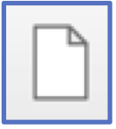{width="3%"} on the menu bar or via the Project pulldown menu (Project\>New).

4.  Save your project (Project\>Save) or the disk icon 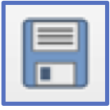{width="4%"}. Important: save your project into your Rome_Data folder. The default locations to save projects and data can make it difficult to remember later where your project is located. And---remember---projects don’t save data; so keeping them together in the same folder is safest.

## Adding Data and Getting Started (!!)

5.  Expand the Tutorial_Data folder. You should see an icon in the shape of a cylinder. This denotes a GeoPackage, which is a database format that allows multiple layers and related data to be stored in one file.

    Now expand the GeoPackage. You should see six layers, all for Rome, Italy:

-   From the [Rome Geoportal](https://www.comune.roma.it/TERRITORIO/nic-gwt/#):
    -   Popolazione Residente Istat 2011 (Population Resident ISTAT 2023)
    -   Luoghi della Cultura (Cultural Locations)
    -   Zone Urbanistiche (Urban Zones)
    -   Waterways (Idrografia)
-   From [Inside Airbnb](http://insideairbnb.com/get-the-data):
    -   AirBnb listings from March 2023
    -   Rome Neighbourhoods

6.  Adding data to your project: Grab and pull the Neighbourhoods_Rome layer down to the bottom left `Layers` window (see below). If this doesn’t work, see Step 9.

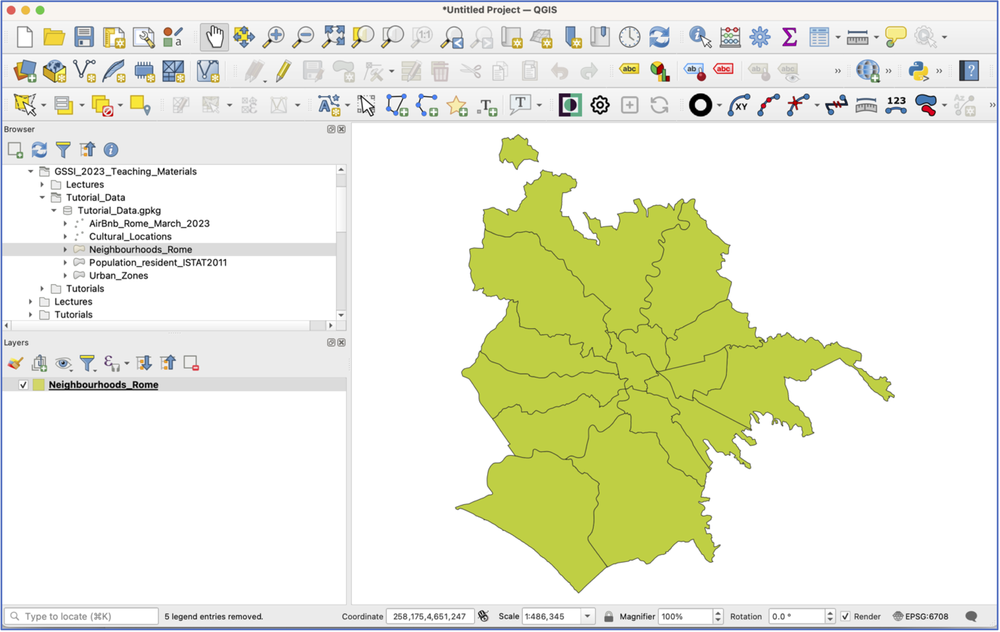{width="60%" fig-align="center"}

7.  Double click on the “Neighbourhoods_Rome” layer and a new window will open. This takes you to the `Layer Properties`, which is where a lot of the work happens in QGIS. Click on the `Source` option and scroll down.

     Note: here is where you can see what projection (that is: coordinate reference system, or CRS) the layer is in, what its file path is, and what variables are included in the attribute table. When you’re done, close the Properties window.

     Another tip: Layer Properties can also be accessed by right-clicking on the layer and choosing Properties. When in doubt, try right-clicking!

8.  Now right click on the “Neighbourhoods_Rome” layer and select `Open Attribute Table`. This opens the data associated with the layer in a new window. You’ll see that this layer has 15 polygons and just one variable: the name of the neighborhood. When you’ve seen enough, close the attribute table.

9.  Another way to add layers is from the `Data Source Manager`, which can be accessed from the menu icon {width="5%"} or via the Layer pulldown menu (Layer\>Data Source Manager).

    Open the `Data Source Manager`. To add layers from a GeoPackage, we first need to connect to it. In the Data Source Manager Window, select `GeoPackage` from the list on the left.

    Now, in the central pane of the window, select “New” under `Connections`, navigate to the Rome_Data GeoPackage and select it, then click `Connect`. You should see all the GeoPackage Layers appear in the window below. Add the “AirBnb”, “Population_resident_ISTAT2011”, and “Waterways” layers by selecting and clicking `Add`. Close the `Data Source Manager` window.

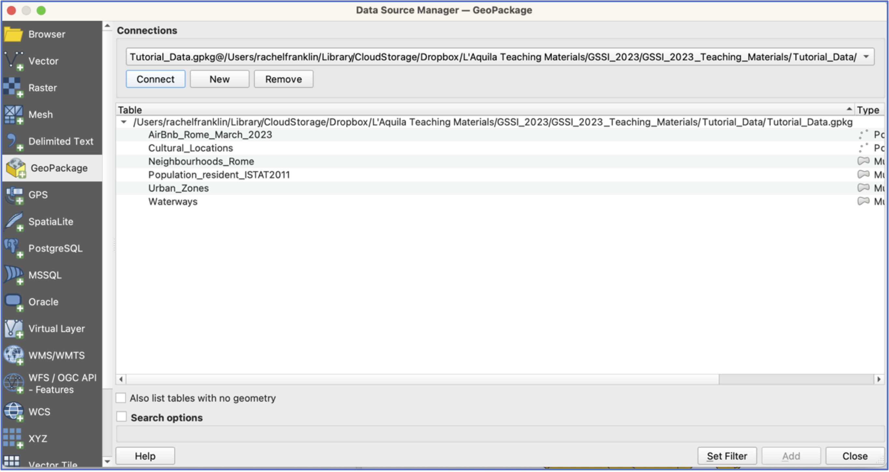{width="80%" fig-align="center"}

 SAVE your project!

10. You should have four layers in your project now, but they are all piled on top of each other. Grab a layer and pull it above or below its neighbours. Try this a few times. What happens when you reorder the layers?

     Tip: If you add layers and decide you don’t want them, right click and select `Remove Layer`.

11. Now right click on each layer and have a look at the attribute tables. What sorts of variables does each contain?

 Remember, QGIS projects do not save any data. They are simply instructions that tell QGIS what data to display and how to display it. If you move your project around without the accompanying layers, the project will be empty.

12. Now spend some time practicing using the tools on the navigation tool bar. Make sure you understand what each tool does.

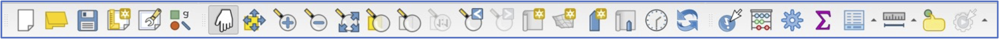{fig-align="center"}

13. Turn off all layers except Neighbourhoods and Population by unticking the box next to them. This keeps the layers in the project, but toggles their visibility. Pull the Population layer to the top. This obscures the Neighbourhoods layer, so let’s adjust the symbology so that we can see which ISTAT Population “census sections” fall into each Neighbourhood.

    Open the `Properties` window for Population and choose the `Symbology` option. You have two choices: you can make the Population layer more transparent so that the Neighbourhoods layer shows through or you can adjust the Population polygon symbology so that the polygon has a border outline, but no fill.

    To change layer transparency, adjust the `Opacity` level until you are satisfied (click `Apply` at the bottom of the window and observe the change on your screen).

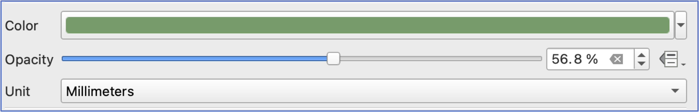{width="90%" fig-align="center"}

14. To change polygon symbology, select the `Simple Fill` square near the top of the window. This will open a new set of symbology options. `Fill` controls what is inside the polygon, whilst `Stroke` controls the color, width, and style of the polygon border. Click on the little arrow to the right of the `Fill color` option, and choose `Transparent Fill`. Click `Apply`. It may take a few iterations to get a stroke color and width that you can see easily.

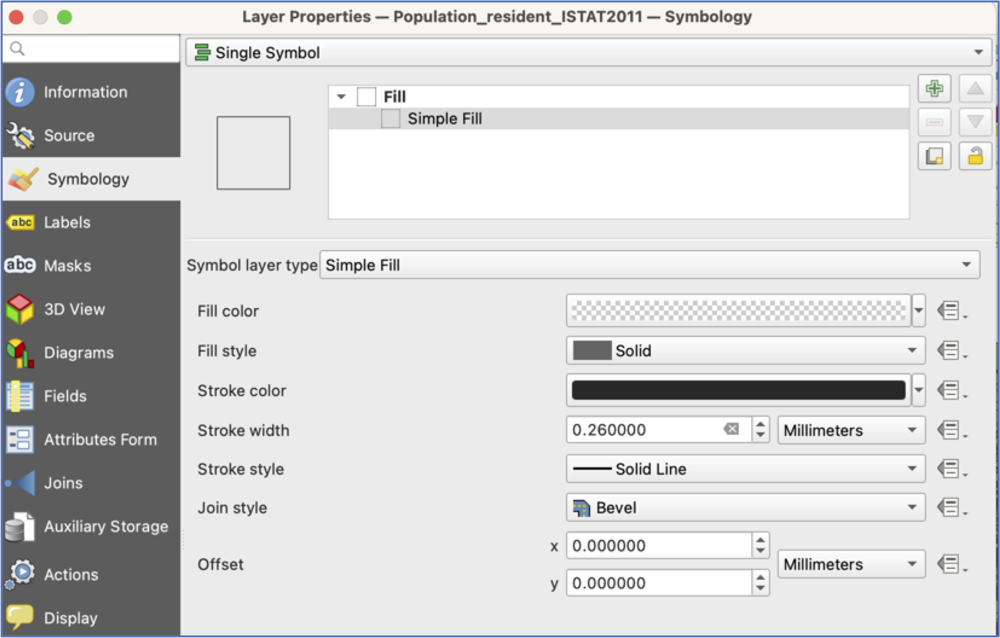{width="90%" fig-align="center"}

15. Open the `Layer Properties` window for Neighbourhoods and choose the `Labels` option. At the top of this window, where it says `No Labels`, there is a pulldown menu. Choose `Single Labels` and `Apply` and leave the defaults for now. Close the `Layer Properties`.

16. Now open the attribute table for the Population layer. The NUMERO_RES variable provides the 2011 resident population count for each census section.

    Click on the variable name at the top of the table to sort the values.

-   Which census areas have the largest population? The lowest?

-   Selecting the numbers at the side of the attribute table will select census sections on the map. Now look at your map---one enormous strength of a GIS is its ability to perform database operations and then show you *on the map* where these entities are located. Is there any pattern to census sections with the highest populations? With zero population? When you’re done looking, be sure to clear your selection: 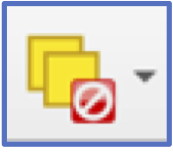{width="5%"}.

17. There’s quite some variety of areas—--some have large populations and some much smaller. However, some districts are also much bigger polygons than others.

    To ease comparison across census polygons, let’s create a new variable for population density. Population density is straightforward to calculate, as a measure of people/square unit of distance (e.g., kilometer, mile, or hectare).

-   **Creating a new variable**: Make sure the Population layer is selected in your layers and then click on the `Field Calculator` icon 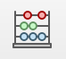{width="5%"}.

     Good to know: the `Field Calculator` can also be accessed from the layer attribute table.

     There are **three** important components to creating a new variable: `Field name`, `field type`, and the `expression` (see below).

    In this case, for field type, choosing integer in this case will only return whole numbers for density. Because we want to include fractional numbers, **choose “Decimal number” for field type**.

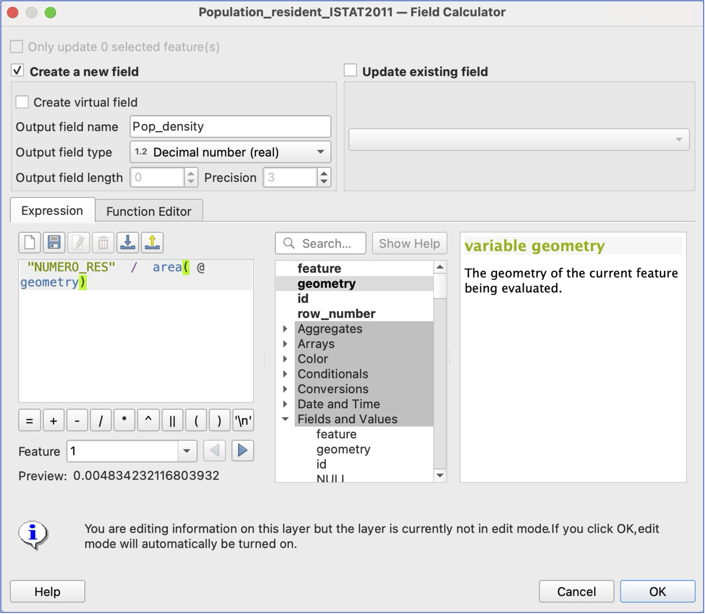{width="90%" fig-align="center"}

-   Click ok. To check your results, either look at the attribute table (the last column) or go directly to layer `Symbology`.

 **Important**: Adding a new variable makes permanent changes to the layer. After adding a new variable in this way, QGIS will require you to click the edit icon 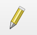{width="4%"} and save your edits—be sure to check you're happy before saying yes!

18. We’ll talk more about map-making, but for now, let’s gain some familiarity with basic symbology. Let’s visualize the variation in Population. To do this, open the `Symbology` window of the `Layer Properties` for the Population layer. At the top of the window where it says `Single Symbol` choose `Graduated`.

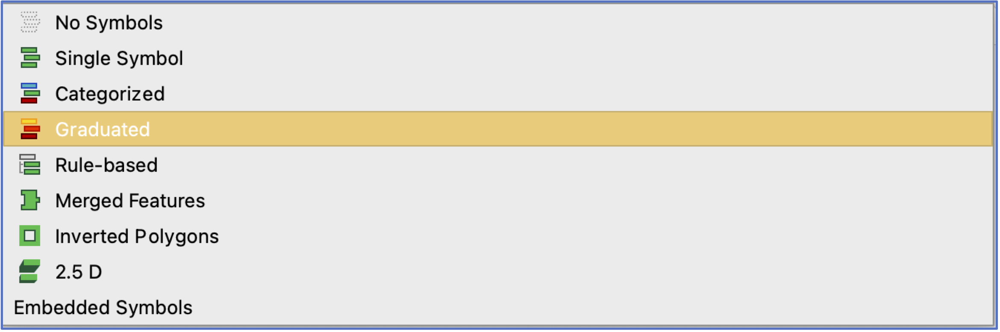{width="90%" fig-align="center"}

-   This will prompt you to choose a `Value`, which is the variable you want to visualise. Choose the “NUMERO_RES” variable.

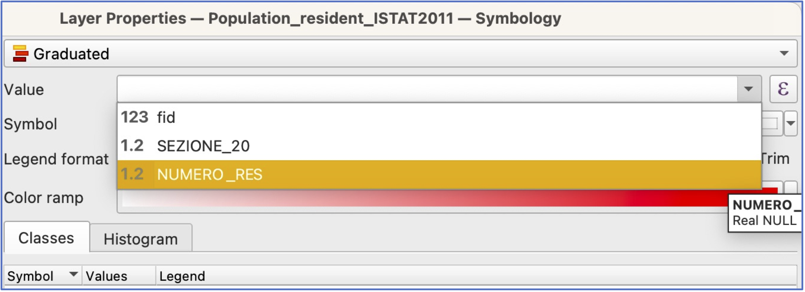{width="90%" fig-align="center"}

-   You will also need to choose which colors you want to use. Click on the arrow by `Color Ramp` and take your pick.

-   Now click `Classify` and `Apply` and `OK`. Take a look at the result—can you still see Neighbourhood boundaries? How do you like the combination of colors? Feel free to make changes.

 Save your project!

19. In the main QGIS window, turn off Population and turn on your Waterways and AirBnb layers.

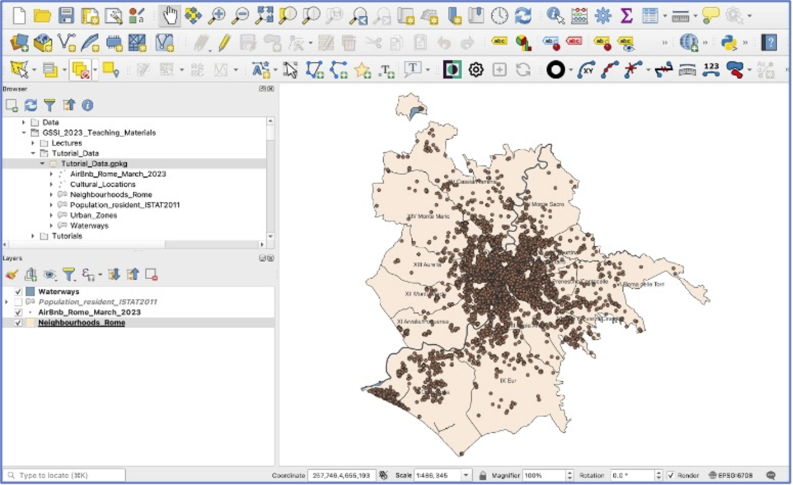{width="90%" fig-align="center"}

20. Open the AirBnb attribute table. Selecting a subset of features: the AirBnb contains a variety of kinds of places to rent. Let’s isolate those where it’s the entire home/apartment.

    To select a sub-category of AirBnb listings, you have two choices, to manually select, by sorting your attribute table as we did above, or `select features by expression` 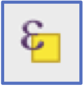{width="4%"}. The latter is much more reliable!

    To select features by expression, you first need to know which variable has the information you want, and which values you’re looking for. Let’s **select all AirBnbs in Rome that offer the entire home/apartment**. Open the `select features by expression` window and then click on `Fields and Values`.

    We will build an expression to select all features where the “room_type” is “Entire home/apt”. Double click on the “room_type” variable, then add an =, and then, on the right side of the window, select `All Unique`.

    This will return a list of all the possible choices for this variable. Select “Entire home/apt” and then double click. You can also search for “Entire home/apt” in the search pane.

    When you’re finished, click `Select Features` at the bottom of the window and close. The top of your attribute table should say you have 17092 features selected (out of 24924), and when you close the attribute table, you should see a lot of points highlighted on the map view.

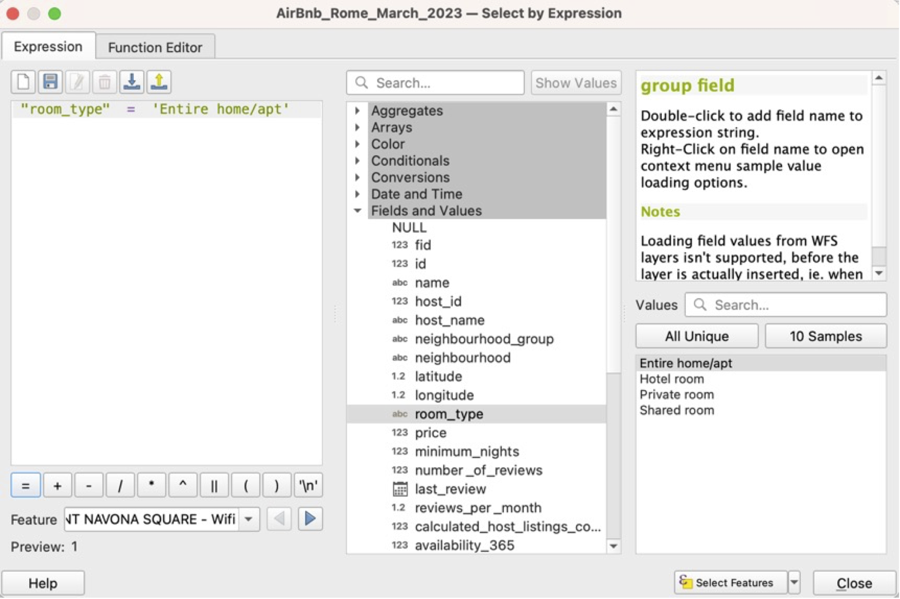{width="90%" fig-align="center"}

21. Creating a new “AirBnb_entire_home” layer: right click on the AirBnb layer and choose Export\>Save selected features. For Format, choose `GeoPackage`. For File name, navigate to the Rome_Data GeoPackage. Then give your new layer a name---AirBnb_entire_home is a good choice. Click OK. Your new AirBnb layer will be added in Layers, and also saved as a **permanent layer** in the GeoPackage, for re-use elsewhere.

    Clear your AirBnb selection and turn that layer off.

22. **Creating and exporting a map layout**. To create a map output that can be saved and used outside the GIS, we need to create a new Print Layout. Click the `New Print Layout` icon {width="4%"} or choose Project\>New Print Layout from the pulldown menu.

    You’ll be prompted to give your layout a name. Choose something descriptive and click OK. A new window will open with a blank page and a new set of layout tools. Click the `Add Map` icon {width="4%"} and then use your mouse to draw a box that covers the entire page. Your layout should automatically populate with your AirBnb + Wards + Waterways layers from the main QGIS view.

23. Take some time to explore the various tools in the layout view. You have the option to add text (e.g., a title), *et cetera*, if you like.  Remember to save your layout occasionally!

24. **Export your AirBnb map**: There are several options for file formats for map exports, including image, SVG, or PDF 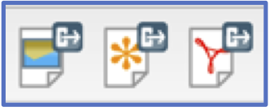{width="10%"}. Click on the `Export as image` option and choose .png for a file format. When prompted, make sure your export resolution is at least 300 dpi and save your map. Save and close this layout (you’ll always be able to go back to it later).

Well done! Take your map home and show it off to your friends!
