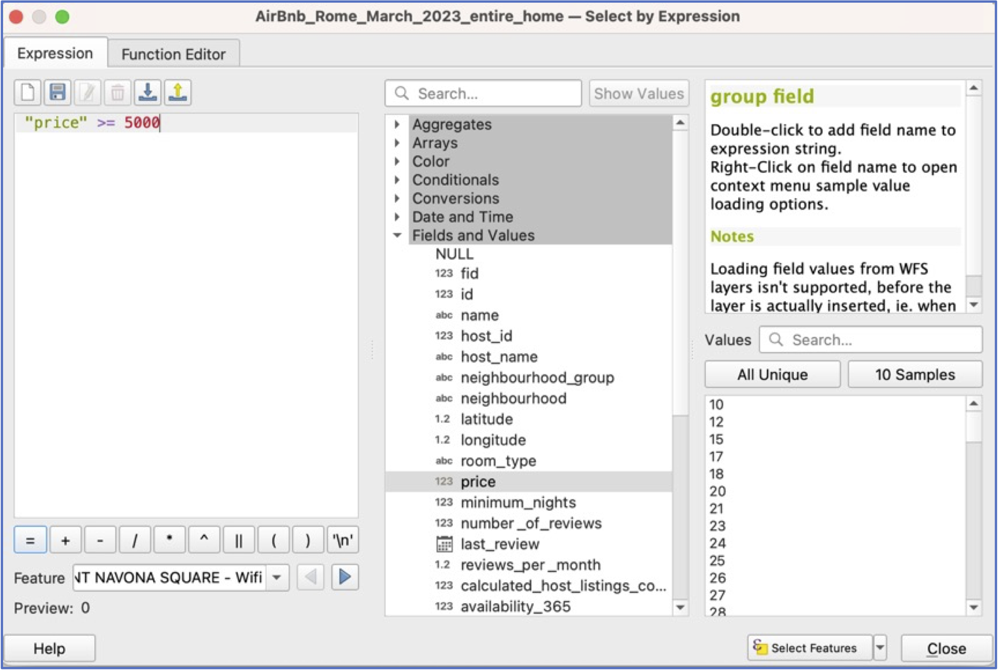
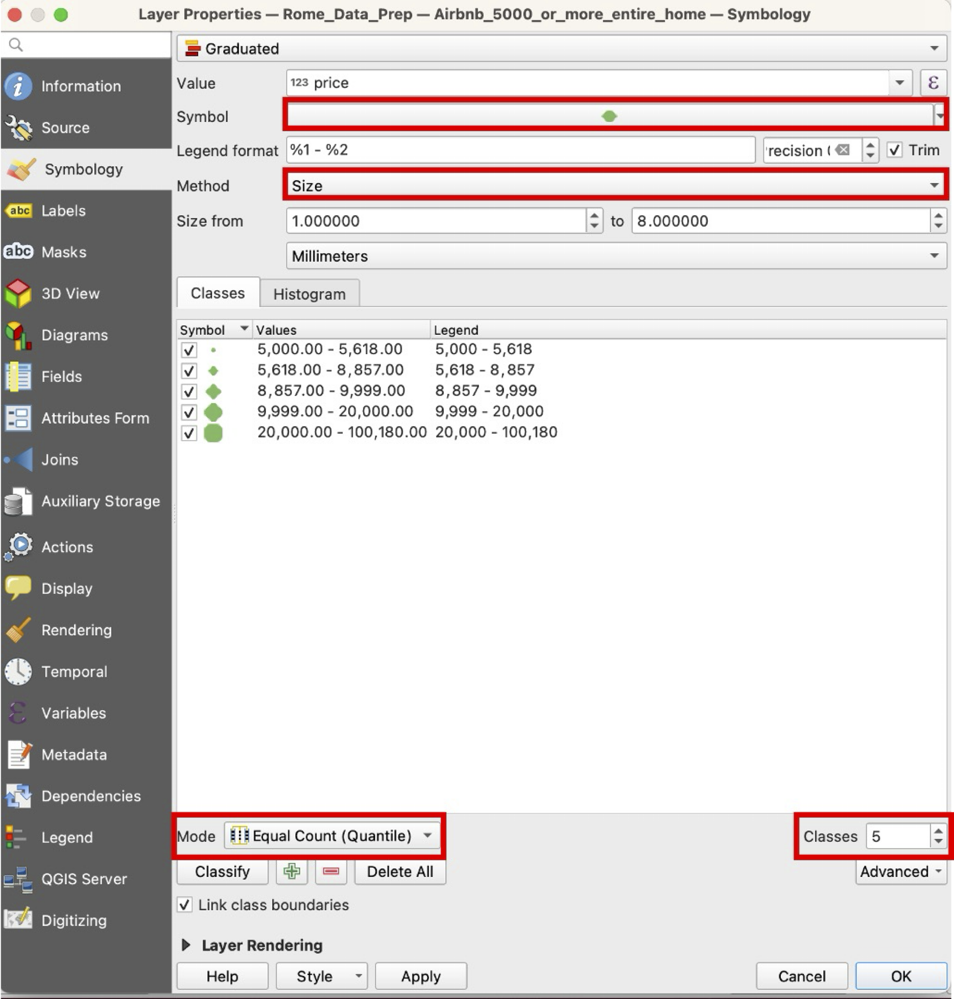
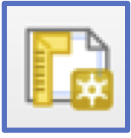
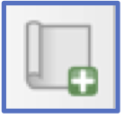
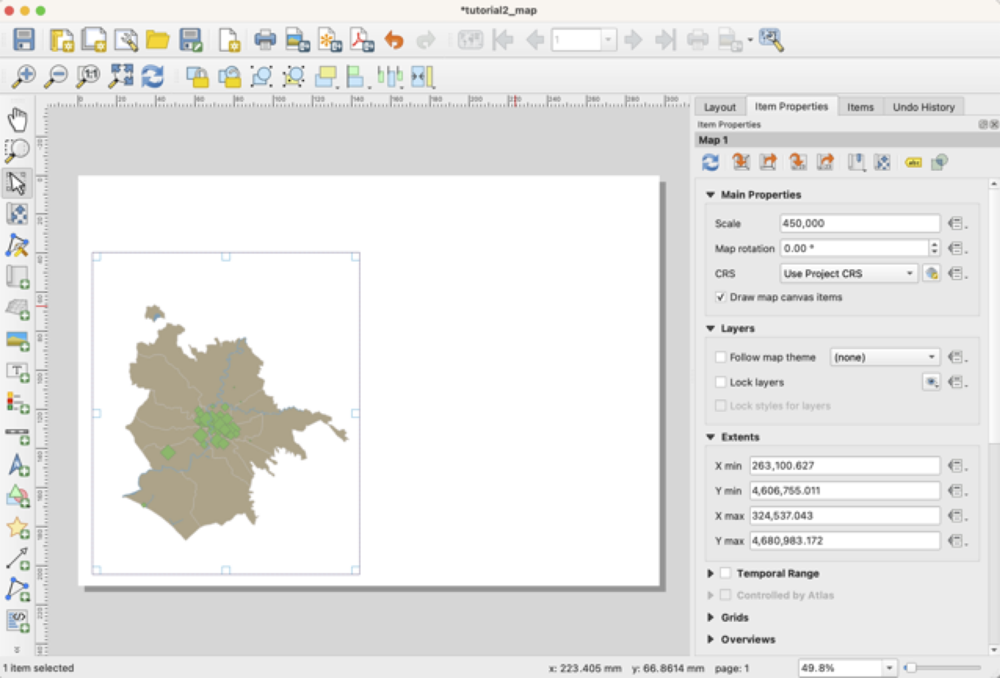
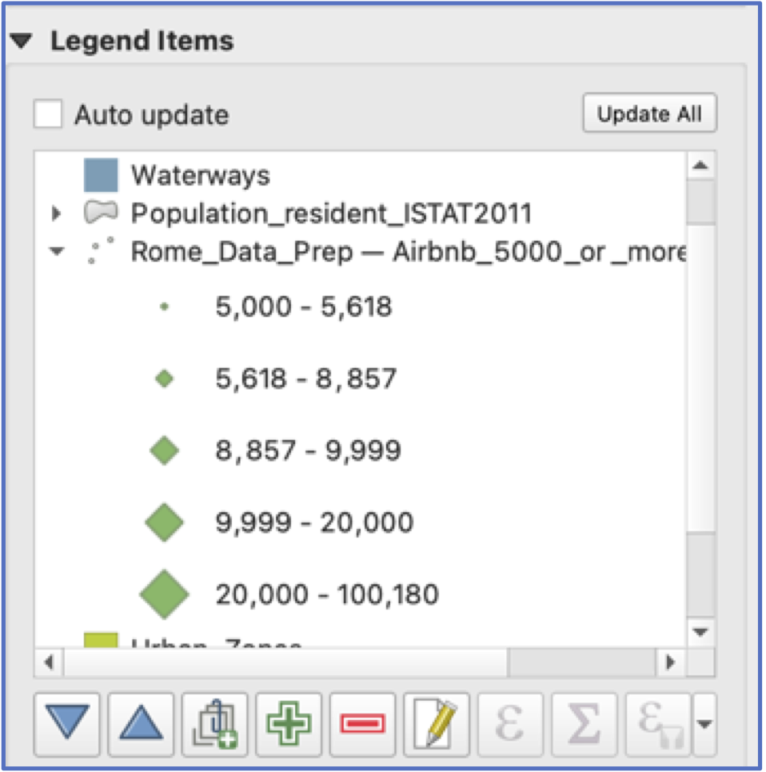
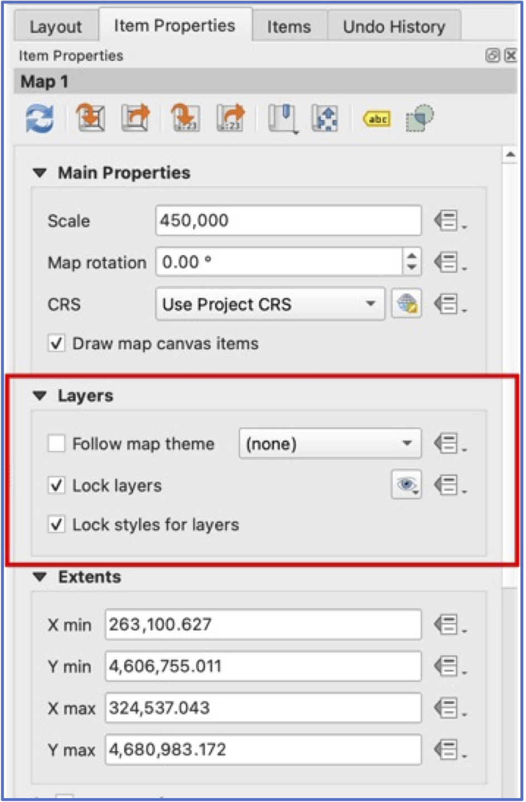
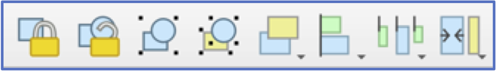

With this practical, we work on our formal cartographic expertise and expand our knowledge of QGIS functionality. By the end of this practical, you should know how to:

-   Design and export a map that includes proper symbology and map elements
-   Select features by their attributes and generate a new layer from the selection
-   Label features
-   Make a map that includes insets or multiple panels

## First Things First---Some Preliminaries

1.  Get set up with your data: it should still be on your desktop (or wherever you're saving to). Otherwise, you can [re-download](Data.qmd).

2.  Start a new QGIS project and navigate to your data. Add the following layers: AirBnbs, Waterways, Cultural Locations, and Neighbourhoods. Save your project ( always save!!!)

## Side-by-Side Maps of Expensive AirBnbs and Cultural Locations

(here, we’ll design one layout containing two maps)

3.  First off, let’s create a layer of AirBnbs that are the entire house/apartment and that cost at least 5000/night.

-   Use an attribute query to select all AirBnbs that are the entire house/apt. You may still have this layer (“AirBnb_entire_home”)---feel free to open it and use it; otherwise, re-create using steps in the first Tutorial.

-   Using the “AirBnb_entire_home” layer, we want to select AirBnbs that cost 5000 or more per night (there should be 56) and then create a new layer (Export\>Save Selected Features), called AirBnb_5000_or_more_entire_home.

{width="70%" fig-align="center"}

4.  Symbolisation of AirBnbs: In your new layer, open `Properties` and go to `Symbology`. To visualise a continuous variable such as price, we need to select `Graduated` from the symbology options at the top. For `Value`, scroll down to the “price” variable.

    Now, for symbolisation, we have a choice between color and symbol size. In fact, there are many choices, including symbol choice, number of classes, and classification scheme. Work through your choices and then click `Classify` at the bottom.

{width="70%" fig-align="center"}

5.  Now spend some time choosing symbology for your Waterways and Neighbourhoods background colours (fill and border). You’re looking for an appealing combination of colours and symbology that still foregrounds the AirBnb data.

6.  Layout: Create a new print layout {width="4%"} and insert a new map window {width="4%"} to take up about half your page in landscape view (see below). Scale of around 450,000 is about right.

{width="80%" fig-align="center"}

 Save!

7.  Now use the options on the left of the `Layout` window to add a Legend, North arrow, and scale bar. Note that each of these items has its own `Properties`, which can be viewed on the right of your screen. These include fonts, font size, and many other choices. Take your time exploring.

     Hint: Legends can be edited by turning off “Auto Update” and then deleting unused layers and changing variable names.

{width="70%" fig-align="center"}

8.  This is half of the map layout. When we go back to the main window, however, any changes we make to layers will automatically refresh in this map window.

    To avoid this, under the Map’s main properties and Layer, click “Lock Layers” and “Lock Styles for Layers”.

{width="50%" fig-align="center"}

9.  Now go back to the main QGIS window, turn off the AirBnb layer, and turn on Cultural Locations.

10. Almost there! Symbolise your Cultural Locations layer, keeping in mind you want your choices to match well with the AirBnb map.

11. Create a second map in your layout that shows Cultural Locations and Neighbourhoods.

12. Finalise and export your map layout. Your final map should include:

-   Title

-   Your name

-   Legends, scale bars, and North arrows for both maps

-   Sensible names for variables in your legend

-   Map windows aligned and of the same size

    -    Hint: these tools in layout view assist with alignment, etc. {width="40%"}

-   Both maps at the same scale
