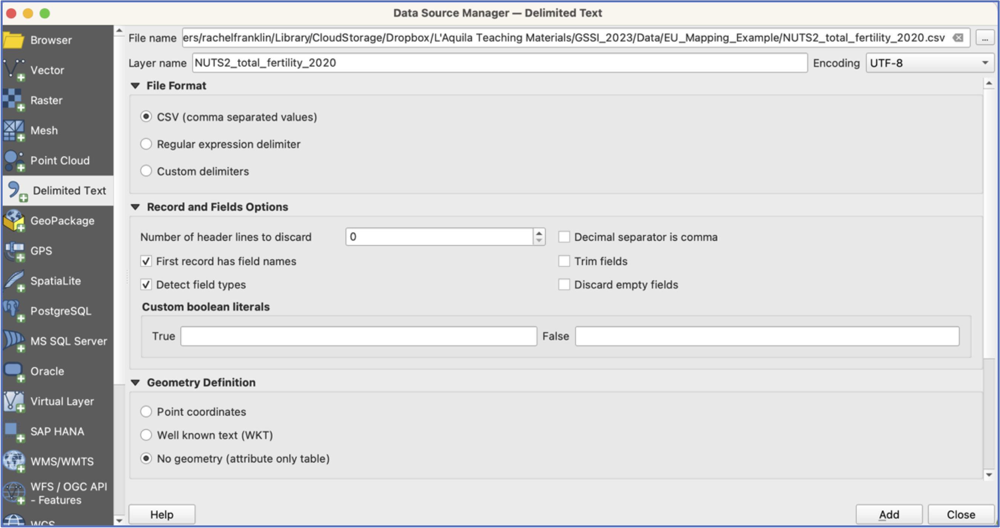
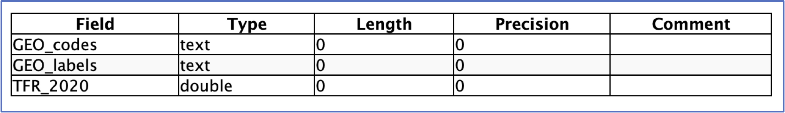
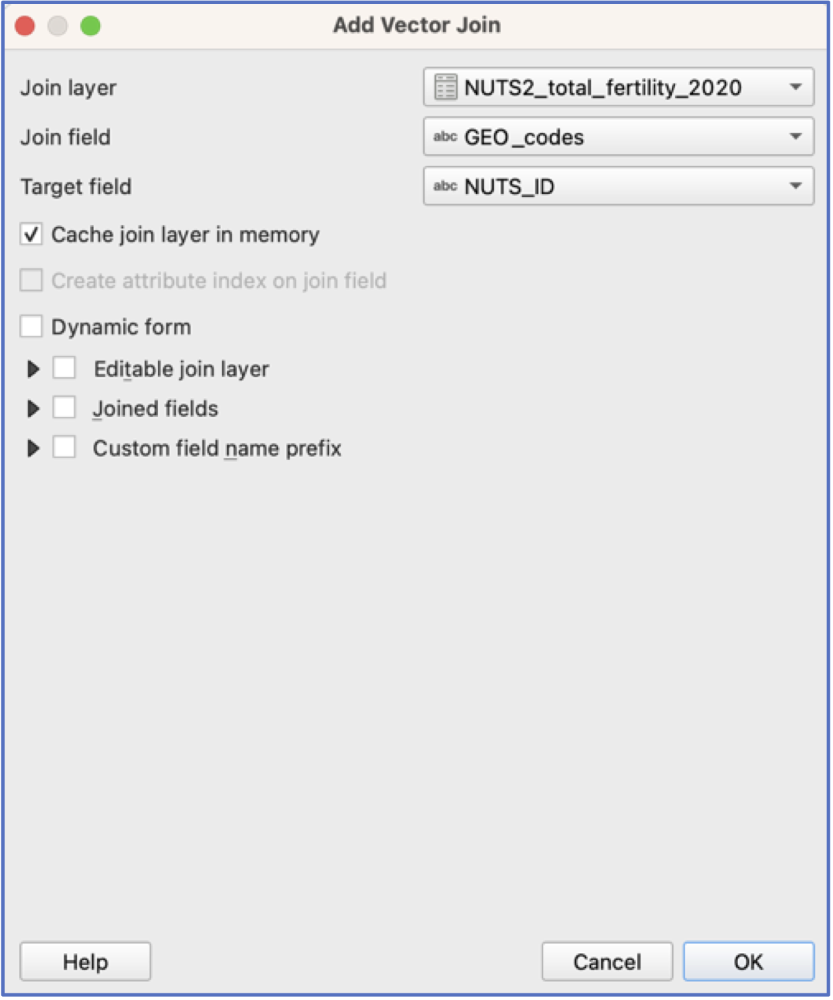

This bonus practical provides some additional practice mapping and also illustrates how table joins work (and are awesome).

1.  Start a new project.

2.  From the [EU mapping example data](Data.qmd), add the NUTS2 regions.

 Save your project!

3.  Have a look at the attribute table by right clicking on the layer and selecting `Open Attribute Table`. You’ll notice that all we have here are region names and codes, but no additional contextual data.

4.  However, we do have Total Fertility Rate data for 2020 in an aspatial spreadsheet format (yay!). To look at this data in QGIS, we need to load the file into the project.

    Open your `Data Source Manager` by clicking on the Data Source Manager icon {width="4%"}. Navigate to the NUTS2 Total Fertility csv spreadsheet in the EU Mapping Example folder and click on it. Click `Add` and `Close`.

{width="70%" fig-align="center"}

5.  You should see the table appear in your layer list, but of course nothing will happen on your map (why?).

6.  Right click on your Fertility table and have a look at the attributes. Everything looks good: we have Name, a code, and a TFR_2020 variable. Close the table.

    Now go to Properties\>Information and scroll down.

     We want to check that the variables have been imported in the correct format—most importantly, that TFR_2020 has been imported as a **number** (double or integer) and *not text* (text or string). Text variables cannot be mapped in the same way as numerical information. Close the `Properties` window.

{width="70%" fig-align="center"}

7.  A common way of getting data into a GIS is to find information in a spreadsheet that can then be combined with the layer attribute table. This is referred to as “joining tables” in a GIS and requires a common column—or primary key–of information in both tables that allows them to be merged into one bigger table that combines both contextual data and location information for each observation.

    This primary key must uniquely identify each observation. Names of areas, such as “Haute-Normandie”, are one option but if Haute-Normandie is referred to as “Haute-Normandie” in one data source and “Haute Normandie” in the other, the GIS won’t know to match them. For this reason, we generally rely on unique identifier codes.

    Let’s join our Fertility data to the NUTS2 layer. To do this, have a look at both attribute tables and identify which variable both tables have in common.

     Note: the variable names do not have to be the same! However, their format (e.g., text) and contents do have to be the same. Here, **GEO_codes** and **NUTS_ID** contain the same information.

    Right click on the NUTS2 Layer, go to `Properties` and then choose `Joins` {width="12%"}. Click on the {width="5%"} the bottom of the interface and a new window will open. Here is where you specify which table to join to the layer attribute table and which codes to use. Click `OK` and then `Apply` and `OK` in the `Join` window.

{width="50%" fig-align="center"}

-   To see if the join worked, open the layer attribute table and scroll to the end. You should see the TFR_2020 variable from the csv table appended at the end. (you can also go directly to `Symbology` and map the TFR variable)

     Important note: No new data have been created! **If you are happy with the join, right click on the layer and choose Export\>Save Features As…** and save a new layer in your `GeoPackage` called NUTS2_TFR_2020. The new layer should be automatically added to your project.

8.  Now we are ready to classify and symbolise the data and then make a map!
