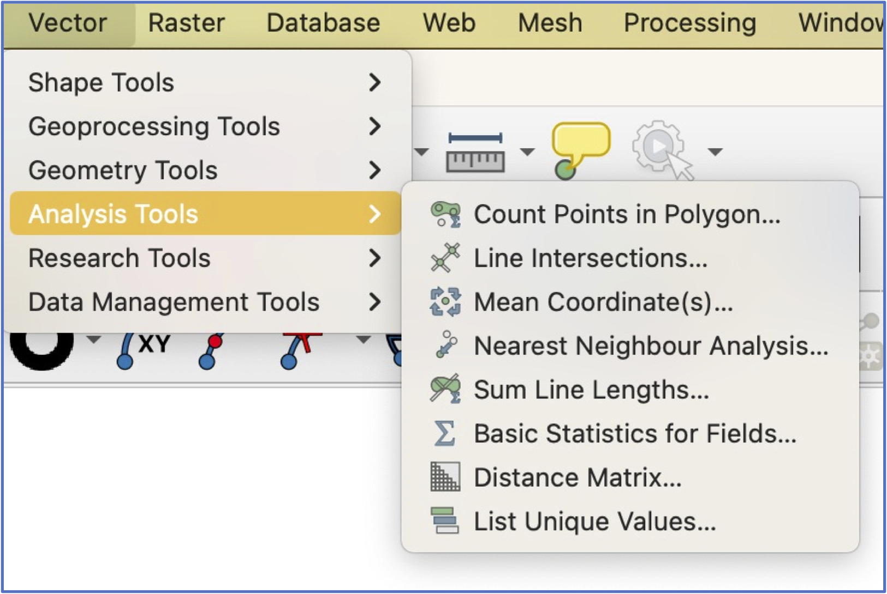
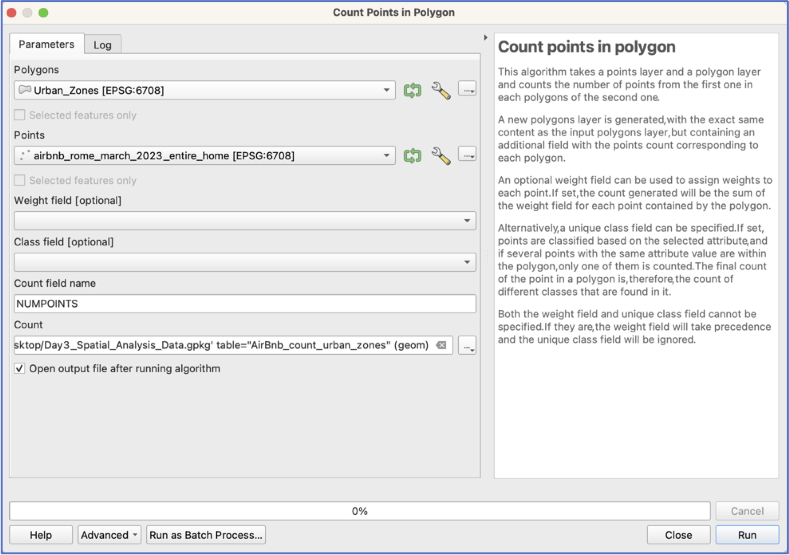
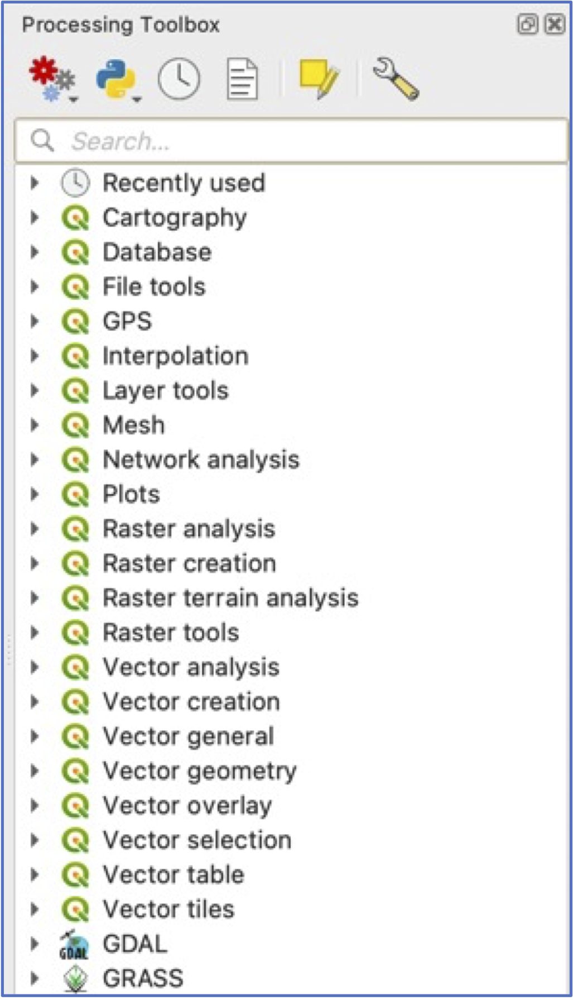
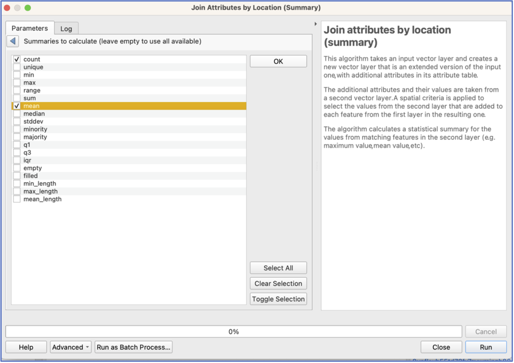
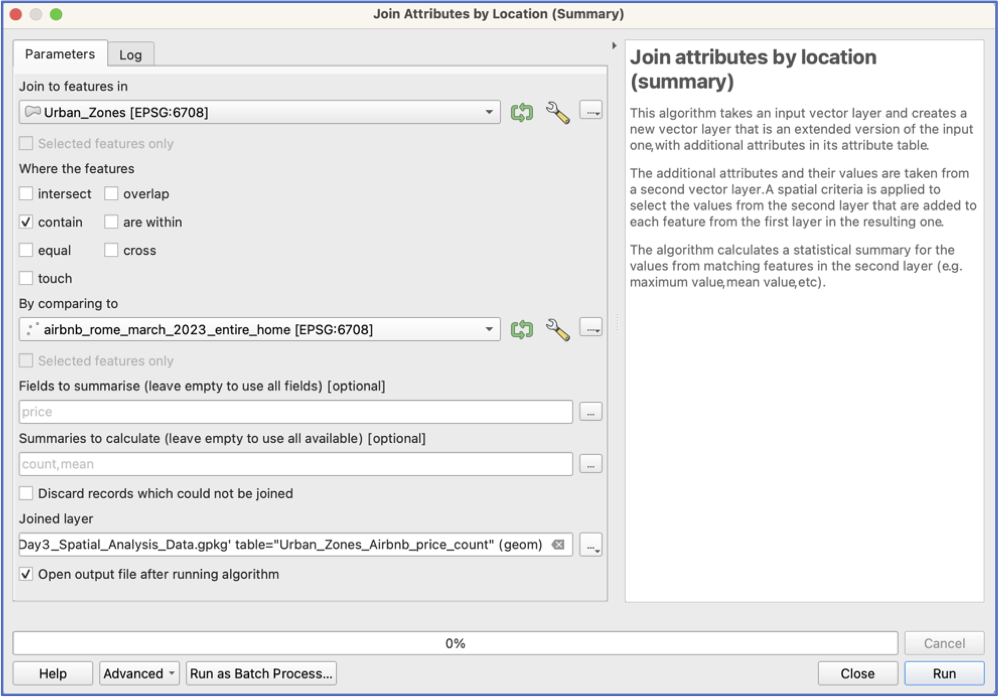
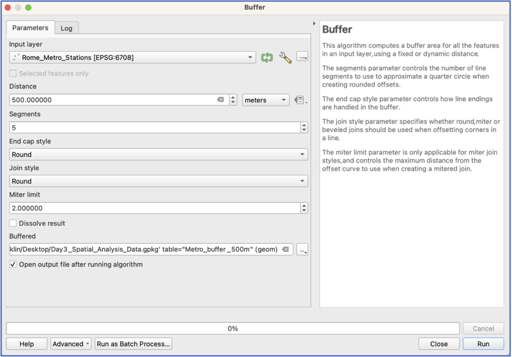

This practical provides practice with common spatial analysis tools and approaches, including:

-   Spatial joins (i.e., counting points in polygons)
-   Buffers
-   Intersects

## First Things First---Some Preliminaries

1.  If you haven't already done so, from the [Data page](Data.qmd), download and expand the Spatial_Analysis folder on your desktop. Add all layers to a new project.

2.  Have a look at the data, which should mostly look familiar. Once again, all layers are for Rome. You should see four:

-   From the [Rome Geoportal](https://www.comune.roma.it/TERRITORIO/nic-gwt/#):
    -   Popolazione Residente Istat 2011 (Population Resident ISTAT 2023)
    -   Zone Urbanistiche (Urban Zones)
-   From Inside Airbnb (http://insideairbnb.com/get-the-data):
    -   AirBnb listings from March 202, only listing for full house/apartment
-   From [Roma Mobilità](https://romamobilita.it/it/tecnologie/dataset-geografici)
    -   Rome Metro Stations (aggregated and cleaned from the original source)

## AirBnb Counts and Prices by Area

3.  Let’s start by exploring alternative ways of visualizing the AirBnb points. The first option is to count the number of AirBnBs falling within each Urban Zone of Rome.

-   Under the Vector\>Analysis Tools pulldown menu, select `Count Points in Polygon`.

{width="60%" fig-align="center"}

-   This will open an interface that asks you to specify the polygons that will receive the points, and the layer that contains the points---we want to use the Urban Zones layer and the AirBnb Layer (see screenshot, below).

     **Important**: many spatial analysis tools create a new layer, so you want to be sure to pay attention to *where* you are saving your output and *what* you are naming it!

{width="80%" fig-align="center"}

-   Your new layer should be automatically added to your project.

     By the way: have you saved your project?!). Go to Symbology and try visualising the counts of AirBnbs by Urban Zone.

4.  What if we want to know the average price of AirBnbs per night, by Urban Zone?

    It makes sense that Zones closer to the Centro Storico might be more expensive. To do this, we use a different, but similar, spatial join tool: `Join Attributes by Location (summary)`

-   To access this tool, we will need to open our QGIS “Toolbox”, which is opened by clicking the toolbox icon {width="5%"}

-   When you open the Toolbox, you are presented with many expandable menus. The tool we want, `Join Attributes by Location (summary)` is located in the “Vector general” menu.

     Note: If you know which tool you are looking for, it's easiest to simply use the search menu!

{width="50%" fig-align="center"}

-   Open the `Join Attributes by Location (summary)` tool.

-   In this interface, we will need to specify how the two layers should be combined—in this case, the Urban Zones *contain* the points. Tick that option.

- Next, under `Fields to summarise`, click {width="5%"} and choose "price"

-   We also need to choose which fields to summarise and which summary statistics to calculate. Click on {width="5%"} for `Fields and Summaries` and choose `Count` and `Mean`:

{width="95%" fig-align="center"}

-   **Choose a location and name to save your new layer.** Your interface should look like below. Click Run.

{width="95%" fig-align="center"}

5.  Visualise your average price results by Urban Zone. Do they make sense?

6.  Next let’s see which Metro stations have the most AirBnbs nearby, and the highest average prices. To do this, we use a new tool---Buffers---as the easiest way to find out quickly which Metro stations have the most AirBnbs.

     If we only wanted a variable that calculates the distance from each AirBnb to the closest Metro, we could use the `distance to Nearest Hub (Points)` tool.

-   The `Buffer` tool is located under the Vector pulldown menu and Geoprocessing Tools (see below). You can also find it by searching the Toolbox.

{width="70%" fig-align="center"}

-   For buffers, we will need to establish what we think is “nearby” a Metro station. Let’s choose 500 meters.

     **Important**: Buffers are always calculated in the units of the projection! If unsure what those are, check properties.

-   As with spatial joins, you will also need to choose where to save your new buffer layer and a name!

     Hint: Make a habit of including your buffer size in your layer name!

{width="70%" fig-align="center"}

-   Click run.

7.  Have a look at your buffers: zoom in, look at the attribute table. Pause and make sure you understand what you're looking at.

8.  Now use a spatial join to count AirBnbs that fall within the ambit of each Metro station’s buffer.

    You can also calculate the average price of AirBnbs within each buffer.

    Are there areas that are clearly more expensive?

## Independent work

9.  Which urban areas contain the highest number of *expensive* AirBnbs?  You'll need to start by defining "expensive".

10. Which areas contain the most AirBnbs per capita?  You may need to refresh your memory of how to create a new variable!

11. Are AirBnbs located close to Metro stations more expensive than those located further away, on average?  Here a dissolved buffer makes more sense than individual Metro buffers!
