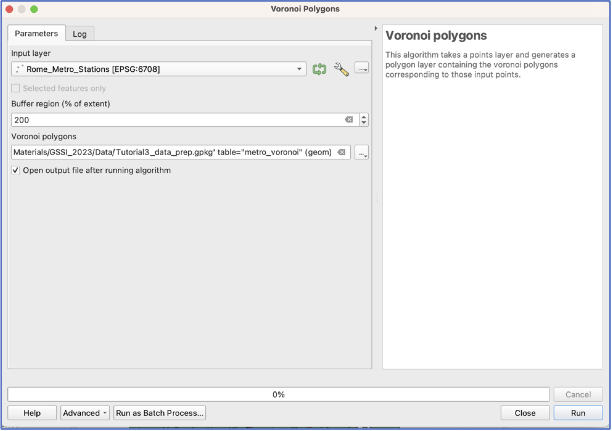
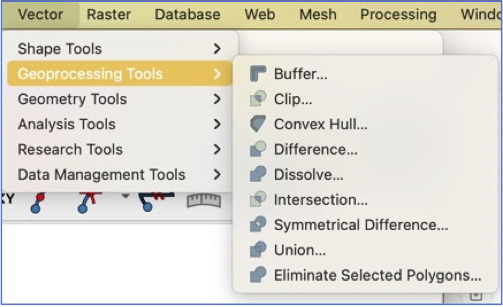

This tutorial introduces additional spatial analysis tools and starts to reinforce independent practice and problem-solving. By the end you should feel more confident with:

-   how spatial questions and challenges can be addressed through spatial analysis and GIS
-   how spatial methods can be combined, or sequenced, in order to answer a question
-   independent troubleshooting

## First Things First---Some Preliminaries

1.  Start a new project and add Metro stations, the Urban Zones, and the Population data.

2.  Adjust your layer symbology so that you can clearly see the distribution of Metro stations.

## Thinking About Metro Accessibility

3.  Let’s consider the parts of the city that have the best access to the Metro. One way to do this is to create Voronoi polygons that partition the city, according to the closest station. This allows us to visualise the “catchment areas” of different stations.

-   In the Toolbox search window, look for `Voronoi polygons`. They will be in the `Vector geometry` area.

-   Open the interface and choose Metro stations as your input layer.

     **Important**: many tools only operate on the minimum area contained by the set of features---since Metros don’t extend across all Urban Zones, our output polygons will not, by default, cover the entire city.

    To adjust for this, we use the `Buffer region` option, which increases the extent of the output layer.

-   Choose a destination and name for your output layer. Click run.

{width="80%" fig-align="center"}

-   Have a look at your output. You may want to rearrange your layers so you can see what’s going on.

4.  Many of the polygons in this new layer extend well outside the border of the city. We will use the `Clip` tool to create an adjusted set of Voronoi polygons that align with Rome’s borders.

-   `Clip` is located in the same place as `Buffer`:

{width="70%" fig-align="center"}

-   Click run and then have a look at your results. What do we see?

## Collaborative group work

5.  What if we wanted to estimate the share of the population that has access to a Metro station?

6.  What are our alternatives for visualizing the distribution of Airbnbs in Rome?
